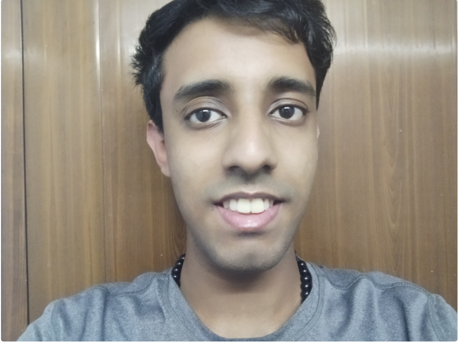

# Welcome to my Gitbooks Page

A word from the author:-&#x20;

Thank you for visiting my Gitbooks page, where I host my personalized walkthroughs of machines that I solve on the Let's Defend and Cyber Defenders platforms

I am Noel Varghese, a Cybersecurity enthusiast - having experience in Secure Coding, OSINT, Pentesting & Threat Intelligence fields, having taken part in Internships, training, and competitions in these.

Now, I am branching my journey towards Blue Teaming, where I will be documenting my journey and cases I solve on LetsDefend and CyberDefenders platforms

Having previous experience in pentesting will prove beneficial as I seek to identify suspicious activity and understand the methodologies exhibited by the malicious actor, to wreak havoc on computer systems, during my blue teaming journey.

Retaining an interest in Secure Coding, I have participated in University level Secure Coding Tournaments, achieving 3'rd rank in OWASP Bangalore Chapter and 38'th rank in Devlymics Champions Tournament, conducted by Secure Code Warriors, Australia

\
Contributed to Darkwebathon, hosted by the [Anti-Human Trafficking Intelligence Initiative (@TeamATII)](https://www.linkedin.com/company/anti-human-trafficking-intelligence-initiative/). During this event, we the help of a 200+ search party scoured the Dark Web, pulled information from tools like Project Hades and Maltego, to identify individuals who operate in gambling, child porn, and CSAM rings&#x20;

\
Cyber Security interests me as an individual, being the subject I am majoring in. Finding new techniques to enforce security in everyday life, and resisting attack attempts is thrilling and requires a whole lot of collective efforts from security professionals and general citizens, to make the world a much secure place. I would very much want to be a part of it

\
I am a champion for incorporating women into the field of Cyber Security, owing to remove the gate barriers that they face, which has led me to be a member of my University's Women in Cyber Security (WiCYS) Chapter. I try to contribute, to the best of my ability, for the good of this organization

\
Empowering them, by sharing nuggets of knowledge and providing them opportunities to foster their learning and growth gives me immense joy

\
🌱 Experience

Interned at NTRDC, Crime Free Bharat, under the Threat Intelligence domain

Interned at Haryana Crime Cell, under the Cyber Security domain

Core Team Member, R\&D (Research and Development) of VITB Cyber Warriors Club at VIT, Bhopal

#### 🤔 Get in touch

I am always open to meeting new people and opportunities

💬 Email- noelatvitb@gmail.com

😄 Connect with me on Linkedin-https://www.linkedin.com/in/noel--varghese/

🌱 Github Profile - [https://github.com/NoelV11](https://github.com/NoelV11)
