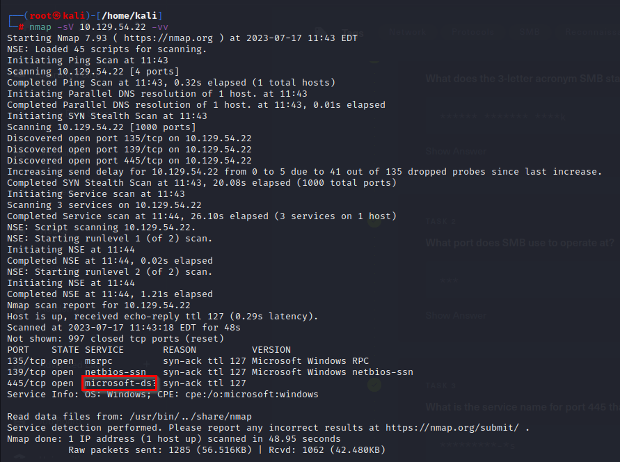
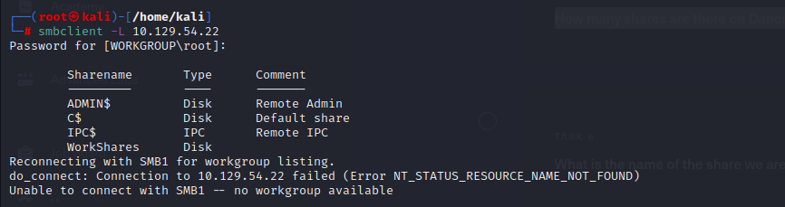
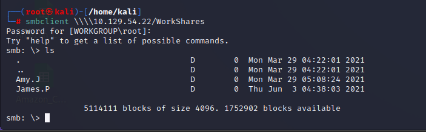
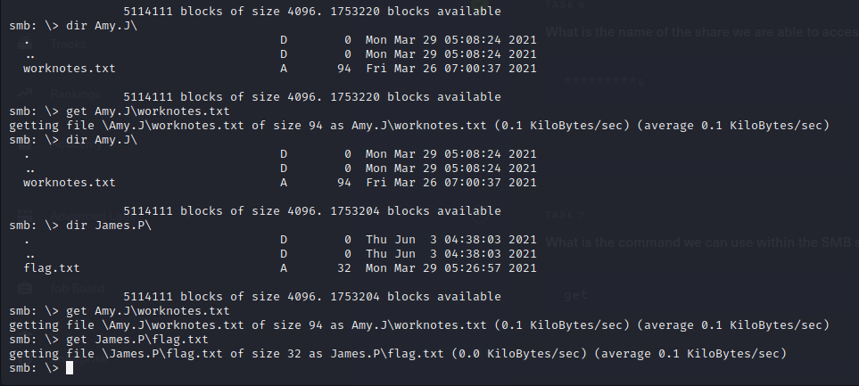

# Dancing

IP Assigned - 10.129.54.22

Let's now dive into the questions.

> Q1) What does the 3-letter acronym SMB stand for?

> A1) Server Message Block

> Q2) What port does SMB use to operate at?

> A2) 445

> Q3) What is the service name for port 445 that came up in our Nmap scan?

Time to run an Nmap scan on the target

> nmap -sV 10.129.54.22 -vv

<figure><figcaption></figcaption></figure>

> A3) microsoft-ds

> Q4) What is the ‘flag’ or ‘switch’ we can use with the SMB tool to ‘list’ the contents of the share?

> A4) -L

> Q5) How many shares are there on Dancing?

Let's take a look, using the smbclient utility, with the shares listing argument (-L)&#x20;

<figure><figcaption></figcaption></figure>

The answer is 4 shares

> A5) 4

> Q6) What is the name of the share we are able to access in the end with a blank password?

Please note that smbclient '/\<Share\_Name' is not the method to access it

Trial and error method to try and connect to each Share, with a blank password

We have logged on to the WorkShares Share, which is a user-created Share

> smbclient \\\10.129.54.22/WorkShares

<figure><figcaption></figcaption></figure>

> A6) WorkShares

> Q7) What is the command we can use within the SMB shell to download the files we find?

> A7) get

This is similar to FTP

Let's list the files, from the directories 'Amy.J' and 'James.P'

We find two files respectively

<figure><figcaption></figcaption></figure>

Let's download them from the SMB Share

> get Amy.J\worknotes.txt get James.P\flag.txt

exit the SMB Share 'exit'

> Q8) Submit root flag

Read the root flag obtained from the SMB Share. Meet at you the next box.

<figure><figcaption></figcaption></figure>
