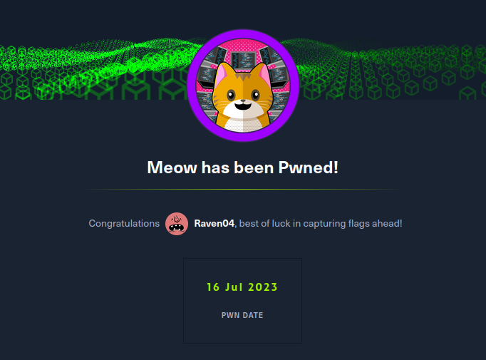

# Meow

Let's start with the proceedings by spawning the machine and connecting to OpenVPN with the configuration file provided by HackTheBox, from the terminal of the hacking machine

Command - openvpn \<name of your configuration file>&#x20;

Please ensure that the connection is established with the message 'Initialization Sequence Completed' on the CLI

We are met with the IP of the 'Meow' machine, which indicates that the machine is up and running. Our connection is also setup

<figure><figcaption></figcaption></figure>

Let's now dive into the questions.

**Please Note**: The questions posed are a mixed bunch. Some of the questions are generic in nature and some will be surrounding the machine that we are about to solve.

> Q1) What does the acronym VM stand for?

> A1) Virtual Machine

> Q2) What tool do we use to interact with the operating system in order to issue commands via the command line, such as the one to start our VPN connection? It’s also known as a console or shell.

> A2) Terminal

This should be evident, as we just used the Terminal to connect to HTB, via Openvpn. The Terminal uses a Command Line Interface (CLI) for the user and machine to interact, using text

> Q3)What service do we use to form our VPN connection into HTB labs?

> A3) Openvpn

> Q4) What is the abbreviated name for a ‘tunnel interface’ in the output of your VPN boot-up sequence output?

> A4) tun

> Q5) What tool do we use to test our connection to the target with an ICMP echo request?

> A5) ping

A ping command, issued from the terminal uses ICMP (type of protocol) to check the availaibility of a host that is connected to the same network as you.

> Q6) What is the name of the most common tool for finding open ports on a target?

> A6) nmap

Network Mapper or Nmap for short

> Q7) What service do we identify on port 23/tcp during our scans?

> A7) 23

Going by common port service convention, Telnet serves on port 23

> Q8) What username is able to log into the target over telnet with a blank password?

NSE Scripts can sometimes help in enumerating users present on services being provided by the machine. This applies to services such as FTP. However in the case of Telnet, it won't be useful

It is a possibility that root / admin users can have an existing account on Telnet&#x20;

> A8) Telnet

> Q9) Submit root flag

a)Let's log on to the Telnet instance on the Meow machine, using the following command - telnet \<Machine IP> \[In some cases, telnet needs to be installed using apt]

b) Login as root and press enter \[ a password would not be required]

<figure><figcaption></figcaption></figure>

c) Running 'ls' command to list the files present, we find our flag file!

&#x20;                   (1).png>)

> A9) \<Your Flag>

Submit the flag and we are good to proceed to Fawn!

&#x20;                   
