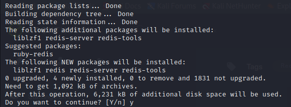
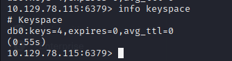

# Redeemer

Let's start by spawning the machine and connecting to Openvpn

We obtain the Machine IP - 10.129.136.187

Let's now dive into the questions.

> Q1) Which TCP port is open on the machine?

A simple scan for the top 1000 ports did not bring any fruitful results

<figure><figcaption></figcaption></figure>

Now, let's proceed by running a through scan across all ports in a stealthy manner

> nmap -sS 10.129.136.187 -vv -p 0–65535

We can find that the port 6379 is open, which is used by Redis Server

<figure><figcaption></figcaption></figure>

> A1) 6379

Had to reboot the machine due to some unforeseen issues. Now the issued IP is - 10.129.78.115. The new IP will be reflected across all future scans and commands

> Q2) Which service is running on the port that is open on the machine?

> A2) redis

> Q3) What type of database is Redis? Choose from the following options: (i) In-memory Database, (ii) Traditional Database

Reading the Redis Utility Documentation from AWS, we are able to understand that Redis is a data storage / database utility that makes use of in-memory storage mechanism. This makes it an in-memory database



Redis is the abbreviated form of Remote Directory Server and is very useful as a storage service for major industries looking to retrieve and store data with present-time capability

> Q4) Which command-line utility is used to interact with the Redis server? Enter the program name you would enter into the terminal without any arguments.

&#x20;"redis-cli" is the utility to be used when trying to interact with local redis servers on your network. First let's install it using apt, as it does not come preinstalled on Unix Kernel

It will be important for us to download it, as it will help us interact with the Redis Server Instance on this machine

<figure><figcaption></figcaption></figure>

> A4) “redis-cli”

Attempting to run redis-cli will cause the utility to establish a connection with any local servers running on port 6379, from localhost

> Q5) Which flag is used with the Redis command-line utility to specify the hostname?

> A5) -h

Meanwhile, let's attempt to connect with the Redis server, on our Hack The Box Environment

> redis-cli -h \<Machine\_IP>

> Q6) Once connected to a Redis server, which command is used to obtain the information and statistics about the Redis server?

> A6) info

The 'info' command would be useful in obtaining information about the redis server.

We can see that our Redis Server has the following statistics \[selected a few metrics here]

<table data-view="cards"><thead><tr><th></th><th></th><th></th></tr></thead><tbody><tr><td><h2>Server</h2>
Redis_version:5.0.7 redis_mode:standalone uptime_in_seconds:1454 

executable:/usr/bin/redis-server 

config_file:/etc/redis/redis.conf
</td><td></td><td></td></tr><tr><td></td><td><h2>Clients</h2>
connected_clients:1
</td><td></td></tr><tr><td></td><td><h2>Memory</h2>
used_memory:859624 total_system_memory:2084024320
</td><td></td></tr><tr><td><h2>Stats</h2>
total_connections_received:6 

total_commands_processed:7 

instantaneous_ops_per_sec:0
</td><td></td><td></td></tr></tbody></table>

> Q7) What is the version of the Redis server being used on the target machine?

> A7) 5.0.7

> Q8) Which command is used to select the desired database in Redis?

Observing the results of the 'info' command that we had run earlier, a section named 'Keyspace' can be observed. The argument keys holds the value 4

<figure><figcaption></figcaption></figure>

This indicates that there are currently 4 databases present in the Redis Server. Let's verify the same, using another command

> info keyspace

The same value has been obtained.

<figure><figcaption></figcaption></figure>

Now, let's proceed to select a database from the available ones \[for example the first database - with index 0]

> select 0

Notice that the keyword used to select the database is 'Select'. When running the command successfully, we are met with a status term 'OK', indicating that the desired database has been selected.

> A8) select

> Q9) How many keys are present inside the database with index 0?

Running the command 'DBSIZE' helps us obtain the number of keys for the database

> A9) DBSIZE

While attempting to solve this box. I decided to learn a bit about 'keys' and their importance with Redis Servers



Think of keys, as a storage container. The type of storage container is what defines the the content it can hold. So keys = storage container Value of a Key = Storage Content



For example integer = 4 \[here the key is integer and 4 is it's value] string = redis \[here the key is string and 4 redis is it's value]



Values can be defined by the user. Hence when we ran the dbsize command on the database at index '0' , it showed that it had a single key and value associated with it \[integer (4)]



In the screenshot placed below, I have demonstrated the method of defining a key, it's values and how i can retrieve the key and it's values



Keys that i have created 'String' and 'ARG'

<figure><figcaption></figcaption></figure>

Keys can hold any value.

> Q10) Which command is used to obtain all the keys in a database?

> A10) keys\*

> Q11) Submit root flag

We can find our root flag here. Observe that flag has been issued as a key here, to hold the alphanumeric value of the flag. Let's read it

> GET flag

<figure><figcaption></figcaption></figure>
