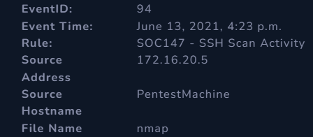
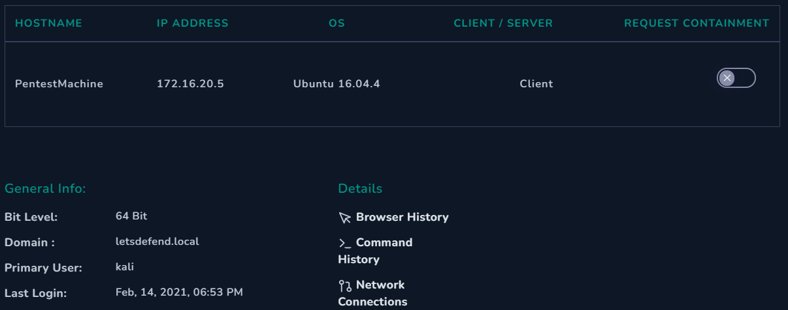
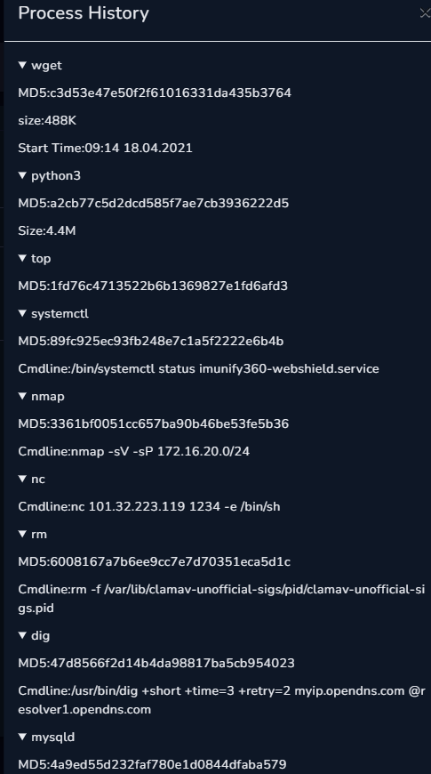
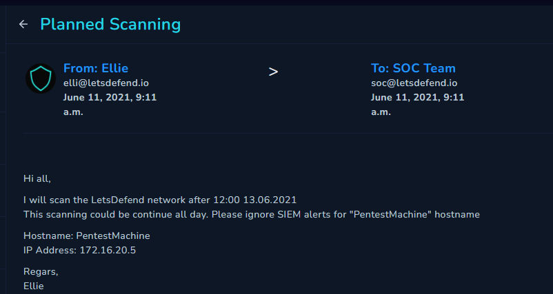

# SOC147 - SSH Scan Activity Alert

Welcome to the world of Blue Teaming, as I explore it on the Let's Defend Platform, a renowned site for Blue Team practice

Today, we are going to get our hands dirty, with the Easy SOC Analyst Alert - SOC147 - SSH Scan Activity. This case is of Low difficulty

**NOTE: Always remember to investigate alerts from Let's Defend, on a VM.**

## Introduction to the Alert

To start the SOC Investigation, we need to "undertake" the case. Woohoo! it is labeled as Malware!

We download the given .zip file onto a VM and unzip its contents, using the passphrase "infected"

## Enumeration

We get a file named 'nmap'. When running file command against it, we get information that it is a binary file

Under the description, we find the hash for the file (3361bf0051cc657ba90b46be53fe5b36)

## Analysis

We run the hash on VirusTotal first, but it came with 0 flagged reports - no security vendors flagged the file as malicious.

.png>)

Next, we run the file's hash on hybrid-analysis.com Under 'Report Search' - enter the hash

There are many OS' acting like a sandbox- we get a hit for Linux 64bit. These are the malware's particulars:-

We get some indicators as well:-

.png>)

Scrolling down, we get to visualize what the file looks like

.png>)

We also get some extracted strings at the bottom (Important)

Let's take the IP Address - 172.16.20.5**.** We run it on the Endpoint Security and Log Management sections of LetsDefend

From the Log Management section, we get a lot of hits for the IP Address, but we try to narrow it down by the time, but don't get any matches for Jun 13,2021 - 04:23 PM (date and time stamp of SOC event occurrence)

Next, we move to Endpoint, where we paste the address and find a few particulars:-

Clicking on Command History, we get:-

Meaning - SSH Scan from 172.16.20.5 to targets in subnet 172.16.20.0/24

From Network Connections, we get:-

.png)

From Process List, we get:

There is nothing much to investigate further, so let's open the playbook and enter the data we have acquired till now

We enter our data and findings

## Alert Scorecard

_False Positive or not? - We clicked Yes (+5 points)_

_Malware or not? - No (-5 points). The file was indeed malware._

_Check if malware is quarantined or not - No (+5 points)_

Bonus - Just checked the 'Mailbox' feature in Let's Defend and searched the IP Address on the search bar, which threw up this email

## Summary of the alert

A malware file was analyzed, which threw a false positive to the SOC Team. The file in fact contained the nmap scan report on hosts, within the 172.16.20.5/24 subnet. The malware file wasn't quarantined as well

## Conclusion

Thank you for reading this blog entry, and stay tuned as I try to close down more SOC alerts……

## Your opinion matters

My audience has a voice. Feel free to reach out to me, on my socials (links are on top of this page) for any queries to be addressed. Dropping a sweet message would make my day

Let your opinion about this write-up be known, by selecting any one of the emojis below!
