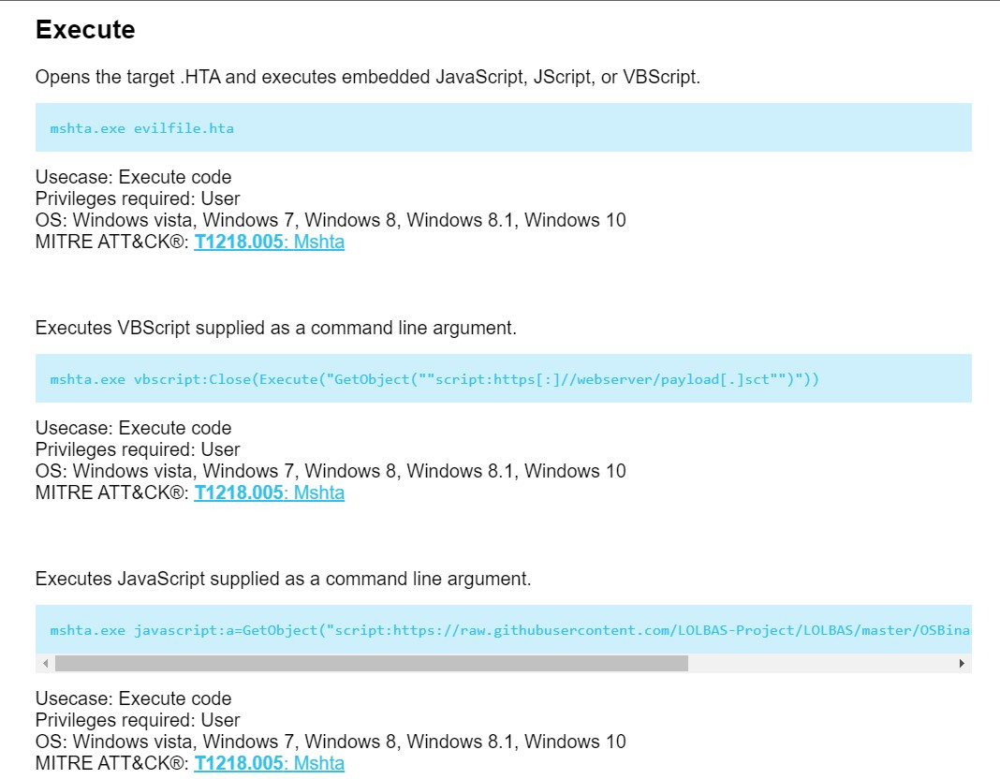

# SOC164 - Suspicious Mshta Behavior Alert

Hello, aspiring blue teamers.Hope you are keeping yourselves hale and hearty

Welcome to this blog entry, as we will be tackling the “SOC164 — Suspicious Mshta Behaviour” alert on the Let’s Defend platform. It was vastly different from the other alerts that I have previously solved on this platform

Let’s jump headfirst into it.

**NOTE: Always remember to investigate alerts from Let’s Defend, on a VM.**

## Introduction to the Alert

Alert particulars provided to the analyst:-

> Create the case

> Start the playbook

### What are Living-off-the-land binaries (LOLBins)?&#x20;

A LoLBin is any binary supplied by the operating system that is normally used for legitimate purposes but can also be abused by malicious actors. Default system binaries have unexpected side effects, which may allow attackers to hide their activities post-exploitation.&#x20;

(Definition: [talosintelligence.com](https://talosintelligence.com/))

## Identify the Binary&#x20;

.jpg>)

> Determine which binary is supplied by the operating system but is also home to suspicious activities. To do this, you can resort to the alert details on the Monitoring page or Endpoint Security.

## Determine Suspicious Activity&#x20;

> Previously, you found the related binary. Now, we’d like you to determine whether it was used for malicious purposes. You can use the link below to determine how legal binary can be used to perform malicious activities.

> [LOLBAS Project](https://lolbas-project.github.io)

> There are some characteristics common to command lines:

> They often have a file-path or other artifact as one of the arguments, that changes based on the user environment or machine, such as usernames or system GUIDs in file paths. The order of arguments in the command change, or a single argument has a slightly different value. They can have randomly generated strings in embedded URLs or file paths. They can be obfuscated on purpose by attackers (variable assignment, invocation of string expressions created on the fly, etc). (list source: sophos.com)

> Is the current activity suspicious?

### **Enumeration - About the binary**

Before we start the investigation, let's try to know more about the mshta.exe binary

According to [Mcafee](https://www.mcafee.com/blogs/other-blogs/mcafee-labs/what-is-mshta-how-can-it-be-used-and-how-to-protect-against-it/),

> To start, it is a signed, native Microsoft binary that already exists on Windows that can execute code in a variety of ways, and in today’s living off the land culture that attackers love, this makes it a prime application of interest since code execution can be proxied through it.

### How does the binary operate?

According to [Red Canary](https://redcanary.com/threat-detection-report/techniques/mshta/),

> There are four primary methods by which adversaries leverage Mshta to execute arbitrary VBScript and JScript:

* Inline via an argument passed in the command line to Mshta
* File-based execution via an [**HTML Application (HTA) file**](https://docs.microsoft.com/en-us/previous-versions/windows/desktop/wiaaut/-wiaaut-getting-started-samples)
* [**COM-based execution for lateral movement**](https://codewhitesec.blogspot.com/2018/07/lethalhta.html)
* By calling the [`RunHTMLApplication`](https://thisissecurity.stormshield.com/2014/08/20/poweliks-command-line-confusion/) export function of `mshtml.dll` with [`rundll32.exe`](https://redcanary.com/threat-detection-report/techniques/rundll32/) as an alternative to `mshta.exe`

Let’s have a look at [LOLBAS](https://lolbas-project.github.io), to identify any characteristics of the binary.Looking it up, we can find the execution methods it employs.They cover languages like JavaScript and VBScript

.jpg>)  (2).jpg>)

Let's return to the platform.

Probing the Process logs of the host, we can find that the binary -mshta.exe did indeed run. A MD5 hash is attached with the instance

> MD5 Hash of .exe = 0b4340ed812dc82ce636c00fa5c9bef2

We are given further evidence that the payload was run, in CLI mode aided by a Powershell script (Ps1.hta)

> Related hash of .ps1 = 6685c433705f558c5535789234db0e5a

Next, we proceed to check out the 'Log Management' section, to find any network traffic logs corresponding to the victim's IP

We got 2 hits, but only 1 fit the bill. Seems like the binary was accessed from the malicious IP - 193.142.58.23&#x20;

When expanding the Process list, we can find an instance of Powershell being executed.

We read earlier that one of the methods in which mshta.exe operates is by executing in an HTA file. So, this means that mshta.exe is indeed being executed for malicious purposes

Hence, we can mark it as Suspicious

> Event marked as suspicious

## What is the Suspicious Activity?

.jpg>)

> What is the purpose of suspicious activities, performed with legal binaries for this incident?

From our initial research on the mshta binary, we found that it is mostly exploited to remotely execute HTML pages

Let's select 'Execute' from the options above

> Execute

## Who Performed the Activity?&#x20;

.jpg>)

> Who performed the suspicious/malicious activity using a binary? It would be helpful to control the binary’s parent process.

By analyzing the MD5 hash of the binary on [VirusTotal](https://www.virustotal.com/gui/home/upload), we can conclude that it is not associated with any malware strain. Joe Sandbox can attest to that claim.

.jpg)

So the attack was supposedly done by a person (threat actor) and not by malicious software

> User

## Containment&#x20;

> Please go to the “EDR” page and contain the user machine!

Let's proceed to contain the victim host

We have successfully contained the host to prevent the spread of threats on the Let’s Defend network

## Add Artifacts

Let’s proceed to submit evidence collected so far, that is relevant to the attack

## ​Analyst's Notes

> Finish the playbook

> Close the alert

## Alert Scorecard

This case was fascinating and I was double happy with the fact that I got all answers right!

Every alert solved is a step towards perfection and I am pretty happy with the score I received.

## Summary of the alert

The SOC Analyst was presented with a suspected binary file that was being used by threat actors to perform remote code execution. With the availability of networking logs and command history, from the victim host, we were able to find the attack vector (Powershell CLI execution), used to conduct the remote attack.

Further analysis was performed on the binary file to find if it had any links to existing malware.It was found that no such association existed. The vulnerability presented in this case was the usage of binaries being signed by trusted entities(in this case Microsoft), which was in turn, being used by attackers to conduct attacks

## Conclusion

Thank you for reading this blog entry, and stay tuned as I try to close down more SOC alerts……

## Your opinion matters

My audience has a voice. Feel free to reach out to me, on my socials (links are on top of this page) for any queries to be addressed. Dropping a sweet message would make my day

Let your opinion about this write-up be known, by selecting any one of the emojis below!
