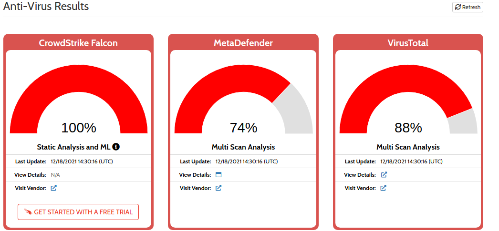

# SOC145 - Ransomware Detected Walkthrough

Welcome to this blog entry,as I document my journey,into the world of blue teaming.We will be tackling "SOC145 - Ransomware Detected" case on the Let's Defend platform,which is of hard difficulty

Let'sjump head first into it.

Case Particulars:-

.png>)

We first take a look at the mailbox,to find any pointers about the case - we couldnt find any matches

Now take the IP Address - 172.16.17.88 and perform a check on the endpoint and log sections

We get this from the Endpoint section,giving a description about the source IP Address' host machine

.png>)

Endpoint Machine Name - MarkPRD - Windows 10 User name - MarkGuna Last Login - Aug 29 2020 08:12 PM

No entries were found for Browser,Network or Command History.We get these entries for Process List&#x20;

.png) .png)

We get a corresponding match for someone named Mark,recieving a mail on Aug 29,when conducting a more through search in the LetsDefend mailbox&#x20;

.png>)

Having performed initial enumeration,lets download the file and unzip it,using the passphrase:infected

We uncover a file named ab.bin.Running file command against it tells us that it is an executable file,with GUI Interface

Next,we take the file for analysis on VirusTotal and Hybrid-Analysis

Hybrid Analysis - (File is classified as Ransomware) Related Hash - d5e2584ff2c17966ac150adfaeaab508af50354c7611884d64207d9c5d6b969c

File Analysis&#x20;

.png)

VirusTotal - 60/68 vendors find the file suspicious

Threat Name - Avaddon MD5 Hash of malicious file - 0b486fe0503524cfe4726a4022fa6a68

Executed Shell commands and process tree of the suspected file

.png>)

More notes about the ransomware file&#x20;

.png>)

No relevant HTTP Traffic or DNS Requests for this file(checked on Hybrid Analysis)

### IOC's of infected file - Image 9 Suspicious indicators - Image 9(1)

Create a case

We select 'Other threat indicator' as classification for this file Malware quarratined or not? - No File is malicious or not? - Yes Check if any address accessed this malicious file? - Yes (we found IP- 81.169.145.105 had accessed this file,from the Log section)

Contain the machine - Yes Now,we add artifacts to the case

IP Address 81.169.145.105 Address that accessed the malicious file IP Address 172.16.17.88 Source address MD5 Hash 0b486fe0503524cfe4726a4022fa6a68 Hash of file

Adding our notes - Images 10 and 10(1) Finish Playbook

Close the alert and state that it is a true positive

Score Card-Image 11
