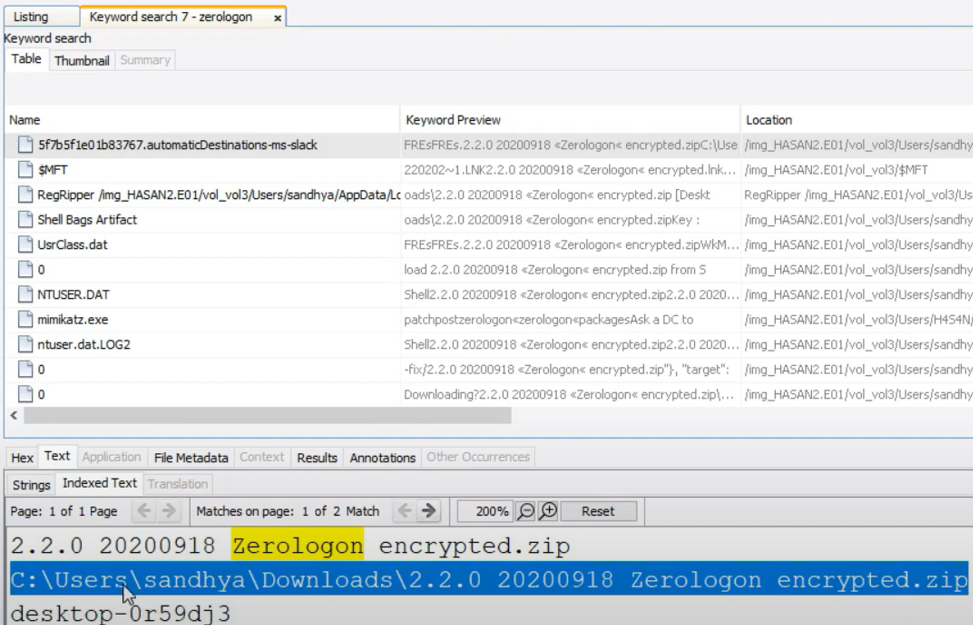

# Disk Analysis & Autopsy: A Walkthrough

Hello readers, welcome to this segment of Noel's Cyberkshetra blogs.

Join me in this blog entry, as I get my hands dirty with some Digital Forensic Investigation practice, in the [Disk Analysis & Autopsy](https://tryhackme.com/room/autopsy2ze0) room, hosted on [Try Hack Me](https://tryhackme.com)

Room creation credits go to [heavenraiza](https://twitter.com/heavenraiza) and [kalighost404](https://www.instagram.com/\_yoo\_yoo.\_/).Massive respect!

## Task 1 -  Windows 10 Disk Image

In the attached VM, there is an Autopsy case file and its corresponding disk image. You need to re-point Autopsy to the disk image file

Your task is to perform a manual analysis of the artifacts discovered by Autopsy to answer the questions below.

Let’s start Autopsy from the Desktop

&#x20;                                                    

Click on ‘New Case’

&#x20;                                                      

Let’s now enter the necessary details about the case 

&#x20;                                                      

After the case has been created, it’s time to import the disk image given to us to analyze

Select Disk Image from the given options and import the disk image located in C:\Users\Administrator\Desktop\Case Files\HASAN2.E01 and click on Next

&#x20;                                                       

Ingest Modules were already run for our convenience

&#x20;                                                        

Takes some time to import all the subfiles for investigation

### Questions

> Q) What is the MD5 hash of the E01 image?

Shifting our focus to the Data Sources’ section on the side tab, we can find our disk to be analyzed

Click on the image and select ‘File Metadata’ on the bottom tab. You will be able to see all metadata about the image, including the MD5 Hash

&#x20;                                                 

> A) 3f08c518adb3b5c1359849657a9b2079

> Q) What is the computer account name?

Investigating the contents Under the ‘Extracted Content’ section, we can observe a section titled ‘Operating System Information’.Clicking on it, we find:-

&#x20;                                                    

The main component of the drive(or PC) is titled ‘DESKTOP-0R59DJ3’

> A) DESKTOP-0R59DJ3

> Q) List all the user accounts. (alphabetical order)

All of the user accounts can be found under the same section, with a SAM password hash for each user

&#x20;                                                 

**NOTE**: Mention the names in alphabetical order

> A) H4S4N,joshwa,keshav,sandhya,shreya,sivapriya,srini,suba

> Q) Who was the last user to log into the computer?

**NOTE**: This data can be received from the SAM itself (under the Date Accessed timestamp)

&#x20;                                                   

From this, it is evident that sivapriya was the last person to access the computer

> A) sivapriya

> Q) What was the IP address of the computer?

When scrolling through the contents of the irunin.ini file located in Data Sources -> HASAN2.E01 -> Vol3 -> Program Files (x86) -> Look@LAN > irunin.ini.We find this entry:-

&#x20;                                                    

This was new knowledge to me.

> A) 192.168.130.216

> Q) What was the MAC address of the computer? (XX-XX-XX-XX-XX-XX)

Scrolling down further, to read the contents of the irunin.ini file, we catch sight of the supposed MAC Address of the computer

&#x20;                                                      

> A) 08–00–27–2c-c4-b9 (place hyphens in between)

> Q) Name the network cards on this computer

To suggest a quick method to find the name of the adapter, we can search for the keyword “Ethernet” in the search bar

This gives us the following log entries:-

&#x20;                                                 

Clicking on the highlighted log entry gives us some content in the window box below

&#x20;                                                  \
We can see the network adapter’s name listed here

> A) Intel(R) PRO/1000 MT Desktop Adapter

> Q) What is the name of the network monitoring tool?

Understand that we found all this network and adapter information from a folder named Look@LAN.Wonder if it is some sort of a network monitoring tool

A quick Google search suffices for that

&#x20;                                           

> A) Look@LAN

> Q) A user bookmarked a Google Maps location. What are the coordinates of the location?

I have a hunch suggesting that the location coordinates can be found from either one of Web History or Web Bookmarks entry lists

When sifting through the entries in the Web Bookmarks section, we come across an interesting one

&#x20;                                         

To read more into this particular entry, we can click on the Results section on the window below, where we find:-

&#x20;                                            

\
The coordinates are found!

> A) 12°52'23.0"N 80°13'25.0"E

> Interesting Tidbit — When searching up these coordinates on Google Maps,I found that the location falles somewhere around Sathyabhama College,located in Semmancheri,Tamil Nadu distirct of India

> Q)A user has his full name printed on his desktop wallpaper. What is the user’s full name?

A quick search on [Super User](https://superuser.com/questions/966650/path-to-current-desktop-backgrounds-in-windows-10) gave us the following path, where wallpapers are saved

Path — C:\Users\anto joshwa\App Data\Roaming\Microsoft\Windows\Themes

> A) anto joshwa

> Q) A user had a file on her desktop. It had a flag but she changed the flag using PowerShell. What was the first flag?

Since it took a long time to go through each user’s Powershell history, I was able to find that user ‘shreya’s Powershell history involved some file meddling

As we navigate to /vol\_vol3/Users/shreya/AppData/Roaming/Microsoft/Windows/Powershell/PSReadline, we can find a file named ConsoleHost\_History.txt.This file holds all traces of changes made to files, via Powershell commands\
Image 15

&#x20;                                         

First, let’s see what Shreya added to the file

&#x20;                                        

What she deleted was our flag:-

&#x20;                                        

> A) flag{HarleyQuinnforQueen}

> Q) The same user found an exploit to escalate privileges on the computer. What was the message to the device owner?

Combing through Shreya’s folders, it wasn't hard to see how she got to elevate her privileges, which was via an exploit (exploit.ps1) located on her Desktop

Reading through the contents of the exploit script, we come across her message

&#x20;                                  

> A) flag{I-hacked-you}

> Q) 2 hack tools focused on passwords were found in the system. What are the names of these tools? (alphabetical order)

Let’s target the Web Downloads folder, in case tools have been downloaded off Github.

Our hunch was not wrong, as I found a suspect mimikatz file here

&#x20;                                    

I was not able to find any other downloads, remotely related to password cracking

As these password cracking software get executed from a single click, or from CLI script execution, the next best thing to do is to run a check on the ‘Run Programs’ section on the side tab

Combing through numerous entries, we were able to find that user h4s4n had executed the mimikatz software

&#x20;                                      

Not long after, the same user executed a suspect software named lazagne.exe, which is supposedly a password cracking tool, that I have not heard of.\
Have a look at this software’s [Github repository](https://github.com/AlessandroZ/LaZagne) 

&#x20;                                      

> A) LaZagne,mimikatz

> Q) There is a YARA file on the computer. Inspect the file. What is the name of the author?

> Knowleedge Nugget — Extension of a yara file — .yar\
> Instead of spending hours sifting thrrough each file entry on the drive,it is wise to enter the yara extension as a keyword on the search tab

Sifting through the resulting entries, we come across this file

&#x20;                                           

Digging through the ‘kiwi\_passwords.yar.link’ file, we can’t get any information from its contents

As you know, Yara files do contain a section for metadata, which contains information about the author, time of the creation of the file, etc.

Now run a search for the keyword “rule”\
We come across another file titled — kiwi\_passwords.yar.link-slack

Running through that file’s contents, we find,

&#x20;                                             

> A) Benjamin DELPY (gentilkiwi)

> Q) One of the users wanted to exploit a domain controller with an MS-NRPC based exploit. What is the filename of the archive that you found? (include the spaces in your answer)

Coming upon the term MS-NRPC, it rang bells about the [Zerologon vulnerability article](https://noelatvitb.gitbook.io/blue--team--investigations/lets-defend-blue-team-walkthroughs/cve-2020-1472-zerologon-vulnerability-exploitation-and-remediation), that I had penned earlier&#x20;

Running a search for Zerologon on the search tab, we come across this file:- 

> A) 2.2.0 20200918 Zerologon encrypted.zip

## Conclusion

This is a great room to practice Windows Forensics, especially when you are a budding Security Analyst, wanting to understand Windows infrastructure

Thank you for reading this blog and stay tuned as I try to close down more SOC alerts……

## Your opinion matters

My audience has a voice. Feel free to reach out to me, on my socials (links are on top of this page) for any queries to be addressed. Dropping a sweet message would make my day

Let your opinion about this write-up be known, by selecting any one of the emojis below!
