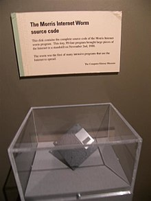

# History of Malware:A Walkthrough

Hello, fellow blue teamers,

Join me in this blog entry, as I guide you to solve Try to Hack Me’s History of Malware room.I had a lot of fun learning about new malware,their family types and stories behind their development.I am pretty sure that you will enjoy it as well.

Room creation credits go to [Darkstar7471](https://twitter.com/darkstar7471).Find him on Discord! - **Bloke#2439**!

## Task 1 - Introduction

This room is dedicated to the first types of **malware**. "Malware" consists of two words combined; _malicious_ and _software_. Typically, Malware is designed to cause damage to Computers or Networks, this may be on a very large scale or only on a **local network** (LAN).

This will teach you a small backstory on how malicious software (malware) has evolved into the complicated viruses you may be exposed to today.

## Task 2 - The Creeper Program

Concepts of Malicious Software have been around since 1949, and one of the first known theories was created by John von Neumann. Von Neumann, who also devised the von Neumann architecture (which is very simply how computers transfer data to its hardware), produced work detailing self-replicating computer programs. This design is arguably the world’s first computer virus but in reality, it is the first concept/design. This concept was proven 22 years later.

This is a basic diagram of the von Neumann architecture.

### Creeper

The Creeper Program, also known as the “Creeper worm” or “virus”, was the first-ever virus to be created. Written by Bob Thomas in 1971, the program used ARPANET (Advanced Research Projects Agency Network) to transfer itself between computers (keep reading to learn about ARPANET). Creeper was created in the programming language PDP-10 Assembly, which ran on the operating system TENEX.

[Bob Thomas](https://malicious.life/episode/episode-1/\)) came up with the idea from the unreliability of computers;

> “computers fail from time to time and work is lost. So I got interested in the possibility of moving an executing program from one computer to another without interrupting the ongoing operation of the program, at least to the extent that to an external observer nothing had happened.”

And this led to the creation of the program. You might be thinking, what did creeper actually do? Well, I’ll tell you! Creeper would iteratively display the following message onto connected teletype computer screens: “I’m the creeper, catch me if you can!”

That is all the program would do, which is why it is not technically malware (it did not cause any harm to the computers or networks it visited) but I had to include it. Robert (the creator) purposely coded it so that it would remove older copies of itself before transferring to the next computer. This was proven useful as some of the software we will talk about in this room does not do that and it can cause accidental harm by copying to the same computer multiple times.



Ray Tomlinson later re-designed the Creeper Virus to copy to each computer, rather than deleting the older copy of itself. Some people claimed that this caused damage because, as said above, the program would accidentally copy to the same computer multiple times (but this was never proven), but what I did find was an interview with Ray Tomlinson. He stated that only 23 computers were infected and all operators of the computers gave permission and even “we only ran it a few times mostly on our own machines for debugging… so it never became a nuisance”, you can read the whole interview here.

Creeper was surprisingly named after a green ghoul on Scooby-doo!

### ARPANET

ARPANET originally started out with two specific protocols; Remote login and transferring files. After their project was denied, the team working on this project (known as the Network Working Group) decided to design a program formally called the Network Control Program, without all the unnecessary details, this was the start of computers being able to communicate within networks.

Packet Switching is breaking data into packets to then route or send said data to the receiver. The receiver (computer that is receiving the data) will then reassemble the packets back into whatever data/file was being sent. (this is still used today!)

This was the main way that data was transferred using ARPANET.

### Questions:-

> Q)Who re-designed the Creeper Virus?

> A)Ray Tomlinson

> Q)How is data transferred through a network?

> A)Packet Switching

> Q)Who created the first concept of a virus?

> A)John von Neumann

> Q)What text did the Creeper program print to the screen?

> A)I’m the creeper, catch me if you can!”

> Q)What does ARPANET stand for?

> A)The Advanced Research Projects Agency Network

> Q)Which team created the network control program?

> A)Network Working Group

> Q)What is the first virus commonly known as?

> A)Creeper

## Task 3 - Reaper

[Reaper](https://en.wikipedia.org/wiki/Reaper\_\(program\)) was created not too long after Creeper was released.\
The creator was Ray Tomlinson which you may recognise as the same person to re-design creeper.

Reaper’s purpose was to remove any copies of creeper that it could find, but it moved differently to Creeper (I’m not 100% sure the full details on this but you can read about it from my reference). Bob Thomas’ main project was “to develop a resource-sharing capability”, known as RSEXEC “so that users could develop applications that could move to and run on another computer”.

Whilst installing RSEXEC they also installed Creeper and Creeper was then used to demonstrate the capability of resource-sharing (This also worked through ARPANET and lots of other stuff, the information provided is vague so if you want to research these viruses then you have to piece it together). Using an RSEXEC API, the application could “package itself and its data up and ship itself to another RSEXEC instance on another computer which would unpack and fire up the application”, but in simpler words, Reaper would move its way similarly to Creeper and then get to work; removing Creeper.

A risk with any software is the possibility of bugs and Ray said that it was a simple program designed to keep track of which computers it moved to. As a result, it would be “pretty trivial to visit them all unless the network became disconnected.”

According to malware.wiki Reaper is called a nematode, which is a type of malware which removes other malware but Reaper was actually the first anti-virus software produced, the term “nematode” is not commonly used nor could I find any documentation for the term.

### Questions:-

> Q)Who created Reaper?

> A)Ray Tomlinson

> Q)What type of malware may Reaper be known as?

> A) Nematode

> Q)What was the first ever anti-virus program known as?

> A)Reaper

> Q)What was Bob Thomas’ main project to develop?

> A)A resource-sharing capability

> Q)Research: What does API stand for?

> A)Application Programming Interface

## Task 4 - Wabbit

The [**Wabbit**](https://resources.infosecinstitute.com/topic/malware-spotlight-wabbit/) (Rabbit) virus was written in 1974. The name, which derived from Elmer Fudd’s way of saying “Rabbit” in the looney tunes cartoons, was one of the first self-replicating malware. The name also connotes to the fast pace in which the software would replicate itself, like that of a rabbit reproducing. Wabbit would work so fast that the system would figuratively choke on its resources and end up crashing.

Rabbit was one of the best versions of malware, not only for its ingenious idea but for its use in education. It was considered the first malicious program (some may argue Creeper was but due to Creeper’s non-harming personality it is not) and grew from concepts of malware created from other computer scientists. The malware was only able to infect the machine it was put on and did not pass via a network, hence why it is not classed as a worm.

Now, we would see Rabbit as being a form of denial-of-service known as a “[fork bomb](https://en.wikipedia.org/wiki/Fork\_bomb)”. (Keep reading for further details.) Variants of Rabbit worked on the system framework IBM OS and worked similar to the original concept.

Rabbit works by creating an infinite loop that continually creates system processes and copies of the original file, creating a high number of CPU cycles (the time for the execution of one process) which “constipates” the system and consumes operating system resources, causing it to get slower until its eventual crash. (Also known as a fork bomb) In modern days, a denial of service attack is an attack which makes a machine, network or server inaccessible to its users.

### Questions:-

> Q)What is a modern day fork bomb also known as?

> A)denial of service attack

> Q)Was Rabbit one of the first malicious programs? (Y/N)

> A)Y

> Q)What did the name “Wabbit” derive from?

> A)looney tunes cartoons

## Task 5 - Animal

In 1975 the first Trojan was written. ANIMAL, created by John Walker, would act as a game and ask the user a number of questions to guess the type of animal they were thinking of.

Whilst the user played the “fun” game, another program, or subroutine, called “PERVADE” would create a copy of itself and ANIMAL in every directory that the user has access to.

A Trojan relates to a wooden horse that the Greeks built during the Trojan War. The story goes that men hid inside the horse which was then given to the city of Troy as a gift. All of the men inside broke out and infiltrated the city from inside winning the war. Similarly to the way that a Trojan pretends to be a friendly program but secretly has a malicious purpose.

ANIMAL was not malicious however, the program was carefully written to ensure that no directory structure or files were damaged. It spread across UNIVACs (Universal Automatic Computer) when users with overlapping permissions discovered the game. Eventually, the program was halted by an unintended Operating System upgrade, which changed the format of the file status tables that PERVADE used for safe copying (file status tables allowed the program to avoid copying to the wrong area, causing damage) this meant that ANIMAL could not find any place safe to copy and stopped itself.

Originally, ANIMAL was coded in 1974 as a non-malicious 20 question game but later the sub-routine (a simple set of instructions embedded within a program) PERVADE was added in 1975. John thought this was a good idea. ANIMAL would eventually be run by a privileged user and “it would copy itself into the system library, thus making it available to all users”, John goes onto say that users exchanged tapes with other installations and as those tapes most likely had ANIMAL on it, John found the program spreading to other systems. Read about this here.

### Questions:-

> Q)When was PERVADE added to ANIMAL?

> A)1975

> Q)Did John think this was a good idea? (Y/N)

> A)Y

> Q)What computers did the program spread across?

> A)UNIVACs

> Q)What type of malware is ANIMAL also known as?

> A)a Trojan

> Q)Who built the wooden horse? (Insert Wooden horse image up)

> A)the Greeks

## Task 6 - Elk Cloner

Richard Skrenta, a 15-year-old high school student known for his pranks and practical jokes, created one of the first microcomputer viruses that spread outside of a computer system or laboratory (also known as “in the wild”).

The malware worked by attaching itself to the Apple II operating systems and spread via floppy disk. It was written in 1982 originally as a practical joke to mess with his friends.

The technique that [Elk Cloner](https://en.wikipedia.org/wiki/Elk\_Cloner) used is a technique now called “boot sector virus”. The program was placed into a game’s code until an unsuspecting victim started the game for the 50th time. This then activated the virus. Instead of launching the game, it would change to a blank screen that displayed a poem about the virus:

If the computer booted from an infected floppy disk, a copy of the virus was placed in the computer’s memory, this then spread to uninfected discs that were inserted into infected computers. Elk Cloner also wrote a signature byte to the disk’s directory, indicating that it had already been infected.

Elk Cloner caused accidental harm as the Apple DOS disks had their reserved tracks overwritten, thus making it malware.

Boot Sector Viruses are less common in modern technology, but still are relevant and important to know about. They usually infect the boot sector (the part which starts the computer) and once infected, they will try to infect every disc inserted into the infected computer but can be removed. The computer does not have to successfully boot in order for the computer to become infected. (you will only see this with floppy discs)

This idea was created when people would no longer give him their floppy discs in order for him to put private or other software on them, he then thought how could he alter people’s discs “without them letting him touch them”, and then the idea was born! Well, not as easy as that. Keep in mind that Richard was extremely talented and loved computers and is a professional, Elk Cloner took him 2 weeks to write in assembly language. Later he found out from a friend in the US Navy that they were among those whose computers caught the virus.

### Questions:-

> Q)Which US Military regiment caught the virus?

> A)US Navy

> Q)How many lines long is the Elk Cloner poem?

> A)7

> Q)When was Elk Cloner written?

> A)1982

> Q)Is a boot sector virus more or less common in modern technology?

> A)less

> Q)How long did it take Richard to write the program?

> A)2 weeks

> Q)Which Operating System was affected?

> A)Apple II

## Task 7 - The Morris Internet Worm

You may have noticed that the creators of the viruses I have shown you previously are not exactly prosecuted or punished. The main reason for this is that the laws were different. For example, when the Creeper virus was made laws were not really as “uptight” about data protection and computer misuse back then as it is now. Malware is a really tough subject and sometimes when you are doing something you think is right or fine, you can accidentally cause unintended harm.&#x20;

Skipping a few years of malicious programs, we come across [The Morris Internet Worm](https://en.wikipedia.org/wiki/Morris\_worm). Released in 1988, Robert Tappan Morris created a worm that was supposed to highlight security flaws of the academic networks that it travelled to. This worked… but not how he expected. The only downfall of the worm was that it failed to check which computers it had already been to, thus infecting many computers multiple times and causing a denial of service attack, commonly known as a fork bomb.\
Morris was the first person to be arrested from a felony conviction in the US under the 1986 Computer Fraud and Abuse act.

The worm spread simply by exploiting known vulnerabilities in Unix Sendmail, rsh (remote shell)/rexec and weak passwords. Although this caused many issues, it did make global awareness of the dangers of weak passwords. The worm infected 2000 computers within 15 hours and it often took 2 days to get off a single computer, rendering most useless. Reportedly 6000 computers were infected in the end and this was around 10% of the internet at the time.

[Berkeley r-commands](https://en.wikipedia.org/wiki/Berkeley\_r-commands) were a very big way that allowed Morris to access the computers, that and weak passwords. Similarly to “ssh”, the worm was able to log in and execute commands on the system, just as you do on Try Hack Me! Although this is a little different as the way he did it was illegal. Many commands that Berkeley r-commands suite uses look very similar also, this is because it was originally designed for UNIX. (It was based on an early implementation of TCP/IP)

### Questions:-

> Q)What commands were a very big way that allowed Morris to access the computers?

> A)Berkeley r-commands

> Q)Who was one the first person prosecuted for the computer misuse act?

> A) Robert Tappan Morris

> Q)What type of attack is a “Fork Bomb”?

> A) Denial of Service

> Q)When was this worm released?

> A)1988

> Q)How many computers did it infect within 15 hours?

> A)2000

> Q)What does rsh mean?

> A)Remote Shell

> Q)Under which act was Morris arrested for?

> A)1986 Computer Fraud and Abuse act

## Task 8 - Cascade

To keep on the topic of first types of malware, Cascade was notably the first type of malware to use a form of encryption. This encryption was not used to directly harm the user’s data, but rather to keep the program undetected. As well as encryption, the virus was hard to detect because of its physical properties; the software was not obvious but some mutations to the code caused bugs and made it a little easier to see.

In the 80s, specifically on the Digital Equipment (a large computer company) operating systems, a common file extension for executables was “.COM”. Similarly to how a BATCH file or a .sh (shell script, used on Linux operating systems) file would work, this extension allowed text files containing commands to be executable.

Something to note is the virus would try not to infect IBM Computers by looking for text containing a copyright statement. This failed however and a bug allowed it to infect all computers. Later on, a headquarter in Belgium owned by IBM was accidentally infected and this lead to them releasing their private anti-virus software. Another thing to note is that the virus would only work by executing the infected file. Each time the infected file was run, it would slowly make changes to the computer.

### **How would you know if your computer was infected?**

There were a few ways to tell if your computer had been infected with the Cascade virus but this differed with the variants of Cascade that were released. In different areas, different forms of the virus were found, some were believed to have “mutated” code, some did not use the encryption and one infected two companies but did not use its trademark sign making it harder to detect (keep reading for more information). All the base source code for these different variants were the same, including the last one that was found. The creator of the virus was presumed to have used another assembler but with the same code, hence the change.

The first obvious tell was checking your file sizes. Infected files would have a much larger file size (specifically by 1704 bytes in most variants) and simply checking this would allow you to properly remove it from your system. In one of these variants, a single byte had seemed to mutate causing a bug in the code, making Cascade infect one file multiple times.

The second way of telling was checking the HOST file. Cascade changed the first 3 bytes of the host file and added it to the first three bytes of the virus’ main file. (I am unsure why it did this exactly as different sources either do not cover it or do not give a full explanation but if you are interested, go ahead and research!) Then, between October 1st and December 31st, the payload would activate. This DOS Malware would make the text fall from the screen one by one until a heap of characters were at the bottom (some say this was an accident) if another payload was running, like that of techno, Cascade would wait until techno had finished until it made the text fall from the screen. On top of that, the computer would emit noises which was popular in many different viruses at this time.

Cascade was truly a big virus, some accounts claiming there were forty different variants. If you find it interesting then you should definitely research it but this room is mainly an overview of the viruses and how they work.

[Cascade Virus in action](https://www.youtube.com/watch?v=z7g-v3d7-Gk)

### Questions

> Q)What was the name of this virus?

> A) Cascade

> Q)What file extensions would this virus infect?

> A).com

> Q)How many variants of there virus were possibly found?

> A)40

> Q)What operating system would the virus run on?

> A)DOS

> Q)Which Operating System/Frame Work would Cascade try to avoid?

> A)IBM

> Q)How many bytes would be added onto your file if it got infected?

> A)1704



## Conclusion

Thank you for reading this blog entry and I hope that you had the same fun as I had,while solving this room

Thank you for reading this blog and stay tuned as I try to close down more SOC alerts……
