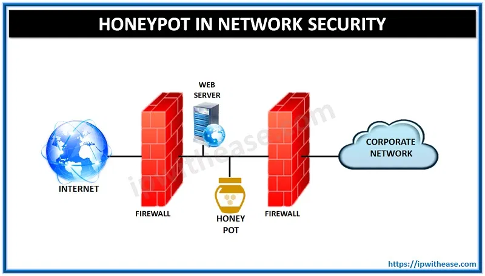

# Introduction to Honeypots

.png>)

Honeypots, now that's something cool to create and work on!

Masquerading as the victim, to catch the bad guys and their evidence?Count me in

Join me as I explore the “[Introduction to Honeypots](https://tryhackme.com/room/introductiontohoneypots)”,hosted on [Try Hack Me](https://tryhackme.com).where we will be doing just that

Room credits go to [CoolCompuerMan](https://tryhackme.com/p/CoolComputerMan).Cheerio!

## Task 1 — Introduction

### **What are honeypots?**

A honeypot is a deliberately vulnerable security tool designed to attract attackers and record the actions of adversaries. Honeypots can be used in a defensive role to alert administrators of potential breaches and to distract attackers away from real infrastructure. Honeypots are also used to collect data on the tools and techniques of adversaries and assist with generating effective defensive measures.

This room will demonstrate the Cowrie honeypot from the perspectives of an adversary and security researcher. This room will also highlight the data collected by a Cowrie honeypot deployment, some analysis methodologies, and what the gathered data tell us about typical botnet activity. We will be taking a look at the medium-interaction SSH honeypot, Cowrie in this demo.



## Task 2 — Types of Honeypots

### **Honeypot Interactivity and Classification**

A wide variety of honeypots exist so it is helpful to classify them by the level of interactivity provided to adversaries, with most honeypots falling into one of the below categories:

* Low-Interaction honeypots offer little interactivity to the adversary and are only capable of simulating the functions that are required to simulate a service and capture attacks against it. Adversaries are not able to perform any post-exploitation activity against these honeypots as they are unable to fully exploit the simulated service.&#x20;

Examples of low-interaction honeypots include [mailoney](https://github.com/awhitehatter/mailoney) and [dionaea](https://github.com/DinoTools/dionaea).

* Medium-Interaction honeypots collect data by emulating both vulnerable services as well as the underlying OS, shell, and file systems. This allows adversaries to complete initial exploits and carry out the post-exploitation activity. Note, that unlike, High-Interaction honeypots (see below), the system presented to adversaries is a simulation. As a result, it is usually not possible for adversaries to complete their full range of post-exploitation activities as the simulation will be unable to function completely or accurately.&#x20;
* High-Interaction honeypots are fully complete systems that are usually Virtual Machines that include deliberate vulnerabilities. Adversaries should be able (but not necessarily allowed) to perform any action against the honeypot as it is a complete system. High-interaction honeypots must be carefully managed, otherwise, there is a risk that an adversary could use the honeypot as a foothold to attack other resources. Cowrie can also operate as an SSH proxy and management system for high-interaction honeypots.

### **Deployment Location**

Once deployed, honeypots can then be further categorized by the exact location of their deployment:

* Internal honeypots are deployed inside a LAN. This type can act as a way to monitor a network for threats originating from the inside, for example, attacks originating from trusted personnel or attacks that by-parse firewalls like phishing attacks. Ideally, these honeypots should never be compromised as this would indicate a **significant breach**.\
  \

* External honeypots are deployed on the open internet and are used to monitor attacks from outside of the LAN. These honeypots can collect much more data on attacks since they are effectively guaranteed to be under attack at all times.

## Task 3 — Cowrie Demo

### **The Cowrie SSH Honeypot**

The Cowrie honeypot can work both as an SSH proxy or as a simulated shell. The demo machine is running the simulated shell. You can log in using the following credentials:

**How to connect to the Honeypot?**

> Start the VM attached with this room

> Download the OpenVPN file and connect to it

```
Command — openvpn <vpnfile.ovpn>
```

> Open a new tab in terminal and connect via SSH,using the following information

> IP — MACHINE\_IP\
> User — root\
> Password — \<ANY>

As you can see the emulated shell is pretty convincing and could catch an unprepared adversary off guard. Most of the commands work like how you’d expect, and the contents of the file system match what would be present on an empty Ubuntu 18.04 installation. However, there are ways to identify this type of Cowrie deployment.

For example, it’s not possible to execute bash scripts as this is a limitation of low and medium interaction honeypots. It’s also possible to identify the default installation as it will mirror a Debian 5 Installation and features a user account named Phil. The default file system also references an outdated CPU.

> Q)Try running some commands in the honeypot

> A)No answer needed

&#x20;                                             

> Q)Create a file and then log back in is the file still there? (Yay/Nay)

> A)Nay

&#x20;                                               

## Task 4 - Cowrie Logs

### **Cowrie Event Logging**

The honeypot wouldn’t be of much use without the ability to collect data on the attacks that it’s subjected to. Fortunately, Cowrie uses an extensive logging system that tracks every connection and command handled by the system. You can access the real SSH port for this demo machine using the following options:

> IP — MACHINE\_IP\
> Port — 1400\
> User — demo\
> Password — demo

The final SSH connection command would be

```
ssh demo@<IP> -p 1400
```

Note: You may need to delete the demo machine’s identity from .ssh/known\_hosts as it will differ from the one used in the honeypot.

Since I had already logged into the honeypot previously, let’s proceed to delete its SSH fingerprint from my Kali machine’s .ssh/known\_hosts file

&#x20;                                             

### **Log Aggregation**

The amount of data collected by honeypots, especially external deployments can quickly exceed the point where it’s no longer practical to parse manually. As a result, it’s often worth deploying Honeypots alongside a logging platform like the ELK stack. Log aggregation platforms can also provide live monitoring capabilities and alerts. This is particularly beneficial when deploying Honeypots, with the intent to respond to attacks rather than to collect data.

At /home/cowrie/honeypot/var/log/cowrie,we find three files

> audit.log,

> cowrie.json and&#x20;

> cowrie.json.2021–09–23

Since the contents of these files are large, i will be attaching a snippet of them below for you to view


&#x20;                                  Contents of cowrie.json (l) and audit.log (r)

**Answer the questions below**

> Have a look through the logs and see how the activity from the last task has been recorded by the system.

> A)No answer needed

## Task 5 — Attacks Against SSH

### **SSH and Brute-Force Attacks**

By default, Cowrie will only expose SSH. This means adversaries will only be able to compromise the honeypot by attacking the SSH service. The attack surface presented by a typical SSH installation is limited so most attacks against the service will take the form of brute-force attacks. Defending against these attacks is relatively simple in most cases as they can be defeated by only allowing public-key authentication or by using strong passwords.&#x20;

A collection of the 200 most common credentials used against old Cowrie deployments has been left on the demo machine and can be used to answer the questions below.&#x20;

\
**Answer the questions below**

> Q)How many passwords include the word “password” or some other variation of it e.g “p@ssw0rd”

We can find the password file at /home/demo titled as ‘Top200Creds.txt’

With multiple attempts to grep our results, I am unsuccessful.At last, I sought some help and came up with this grep query

```
grep “p.a*ss” Top200Creds.txt
```

Since all instances of “password” start with the letter ‘p’ and have 'ss' as constants in every form in appears in

&#x20;                                                

> A)15

> Q)What is arguably the most common tool for brute-forcing SSH?

> A)hydra

> Q)What intrusion prevention software framework is commonly used to mitigate SSH brute-force attacks?

A quick google search gives “Fail2 Ban” as the answer \


> A)Fail2Ban

## Task 6 — Typical Bot Activity

### **Typical Post Exploitation Activity**

The majority of attacks against typical SSH deployments are automated in some way. As a result, most of the post-exploitation activity that takes place after a bot gains initial access to the honeypot will follow a broad pattern. In general, most bots will perform a combination of the following:

* Perform some reconnaissance using the uname or nproc commands or by reading the contents of files like /etc/issue and /proc/cpuinfo. It’s possible to change the contents of all these files so the honeypot can pretend to be a server or even an IoT toaster.\
  \

* Install malicious software by piping a remote shell script into bash. Often this is performed using wget or curl though, bots will occasionally use FTP. Cowrie will download each unique occurrence of a file but prevent the scripts from being executed. Most of the scripts tend to reference cryptocurrency mining in some way.\
  \

* A more limited number of bots will then perform some anti-forensics tasks by deleting various logs and disabling bash history. This doesn’t affect Cowrie since all the actions are logged externally.\
  \


Bots are not limited to these actions in any way and there is still some variation in the methods and goals of bots. Run through the questions below to further understand how adversaries typically perform reconnaissance against Linux systems.

**Answer the questions below**

> Q) What CPU does the honeypot “use”?

> A)Intel(R) Core(TM) i9–11900KB CPU @ 3.30GHz

> Q)Does the honeypot return the correct values when uname -a is run? (Yay/Nay)

&#x20;                                                    

We can see that the versions don't match

> A)Nay

> Q)What flag must be set to pipe wget output into bash?

> A) -o

> Q)How would you disable bash history using unset?

> A)unset HISTFILE

## Task 7 — Identification Techniques

### **Bot Identification**

It is possible to use the data recorded by Cowrie to identify individual bots. The factors that can identify traffic from individual botnets are not always the same. However, some artifacts tend to be consistent across bots including, the IP addresses requested by bots and the specific order of commands. Identifiable messages may also be present in scripts or commands though this is uncommon. Some bots may also use highly identifiable public SSH keys to maintain persistence.

It’s also possible to identify bots from the scripts that are downloaded by the honeypot, using the same methods that would be used to identify other malware samples.

Take a look at the samples included with the demo machine and answer the below questions.

**Note**: Don’t run any of the commands found in the samples as you may end up compromising whatever machine that runs them!

**Answer the questions below**

> Q) What brand of device is the bot in the first sample searching for? (BotCommands/Sample1.txt)

Taking a look at the Sample1.txt log

&#x20;                                                    

I experimented with copy-pasting the grep command on the Internet

Interestingly,I got a hit for a brand named ‘Microtik” that are excessively targeted

&#x20;                                                     

> A)Mikrotik

> Q)What are the commands in the second sample changing? (BotCommands/Sample2.txt)

Taking a look at the Sample2.txt log

&#x20;                                                     

It is evident that the commands are targeting some type of password change in the /etc/ folder, for the root user

> A)root password

> Q)What is the name of the group that runs the botnet in the third sample? (BotCommands/Sample3.txt)

Taking a look at the Sample3.txt log

&#x20;                                                   

We see a curious string ‘mdrfckr’ in the file. Researching more about it on Google gave me answers. It is a well known threat-actor group

&#x20;                                                   

> A)Outlaw

## Task 8 — SSH Tunneling

### **Attacks Performed Using SSH Tunnelling**

Some bots will not perform any actions directly against honeypot and instead will leverage a compromised SSH deployment itself. This is accomplished with the use of SSH tunnels. In short, SSH tunnels forward network traffic between nodes via an encrypted tunnel. SSH tunnels can then add a layer of secrecy when attacking other targets as third parties are unable to see the contents of packets that are forwarded through the tunnel. Forwarding via SSH tunnels also allows an adversary to hide their true public IP in much the same way a VPN would.

The IP obfuscation can then be used to facilitate schemes that require the use of multiple different public IP addresses like, SEO boosting and spamming. SSH tunneling may also be used to by-parse IP-based rate limiting tools like Fail2Ban as an adversary can transfer to a different IP once they have been blocked.

### **SSH Tunnelling Data in Cowrie**

By default, Cowrie will record all of the SSH tunneling requests received by the honeypot but, will not forward them on to their destination. This data is of particular importance as it allows for the monitoring and discovery of web attacks, that may not have been found by another honeypot. I’ve included a couple of samples sort of data that can be recorded from SSH tunnels.

Note: Some elements have been redacted from the samples to protect vulnerable servers.

**Answer the questions below**

> Q)What application is being targetted in the first sample? (Tunnelling/Sample1.txt)

> A)Wordpress

> Q)Is the URL in the second sample malicious? (Tunnelling/Sample2.txt) (Yay/Nay)

> A)Nay

## Task 9 Recap and Extra Resources

### **Recap**

I hope this room has demonstrated how interesting honeypots can be and how the data that we can collect from them can be used to gain insight into the operations of botnets and other malicious actors.

### **Extra Resources**

I’ve included some extra resources to assist in learning more about honeypots below:

[Awesome Honeypots — A curated list of honeypots](https://github.com/paralax/awesome-honeypots) \
[Cowrie — The SSH honeypot used in the demo](https://github.com/cowrie/cowrie)&#x20;

Sending Cowrie Output to ELK — A good example of how to implement live log monitoring ([https://cowrie.readthedocs.io/en/latest/elk/README.html](https://cowrie.readthedocs.io/en/latest/elk/README.html))

I would also recommend that you deploy a honeypot yourself as it’s a great way to learn. Deploying a honeypot is also a great way to understand how to work with cloud providers since external honeypots are best when deployed to the cloud. Deploying and managing multiple honeypots is also an interesting challenge and a good way to gain practical experience with tools like Ansible

## Conclusion

Creating and experimenting with a honeypot is one objective on my to-do list. The thought of deploying one was keeping me off, from executing the idea.

Now, I am armed with some handy resources and am off to deploy one!

Thank you for reading this blog entry and stay tuned

## Your opinion matters

My audience has a voice. Feel free to reach out to me, on my socials (links are on top of this page) for any queries to be addressed. Dropping a sweet message would make my day

Let your opinion about this write-up be known, by selecting any one of the emojis below!
