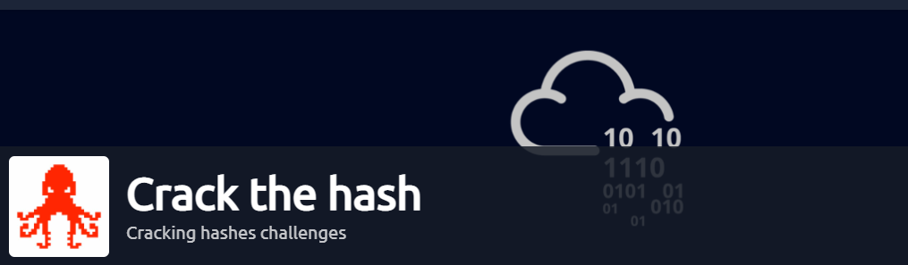

# Crack The Hash: A Walkthrough

We've got some hashes to crack, are you down with me to crack them? Join me as I attempt to solve the [Crack the Hash](https://tryhackme.com/room/crackthehash) room on Try Hack Me

Room credits go to [Ben](https://twitter.com/0x8445). Awesome stuff!

**NOTE: Always remember to investigate rooms from Try Hack Me, on a VM.**

## Task 1 - Level 1

**Can you complete the level 1 tasks by cracking the hashes?**

I am mainly going to make use of 5 main tools in this room:-

* hash-identifier
* John The Ripper
* Crack Station
* Hashcat
* Google

> Q) 48bb6e862e54f2a795ffc4e541caed4d

To identify the type of hash, let’s first consult hash-identifier, which is a Kali Linux based CLI-tool

Install using apt (if not installed already) — `apt install hash-identifier`\
Tool Syntax — hash-identifier \<hash>

Running the hash on hash-identifier tool did not give us any leads about the type of the hash

Then we do have a trusty online tool — [Crackstation](https://crackstation.net)

> **NOTE**:Yes,the cracked password will be visible as I input the hash,but there is no fun in that!

Let’s do it in CLI mode, making use of John The Ripper to crack the password

&#x20;                                  

`Command - john — format=md5 — wordlist=/usr/share/wordlists/rockyou.txt Uncracked_Password >> Cracked_Password`

The initial query wasn't working, Then I tried running the same command, using type as RAW-MD5

`Command - john — format=raw-md5 — wordlist=/usr/share/wordlists/rockyou.txt Uncracked_Password >> Cracked_Password`

The hash got cracked in an instant!

&#x20;                                  

Verifying it online with CrackStation.We are right!

&#x20;                                    

> A) easy

> Q) CBFDAC6008F9CAB4083784CBD1874F76618D2A97

Similar to the previous hash, hash-identifier was not able to find the hash

Running it on Crack Station, we get to know that it is a SHA1 hash

&#x20;                                         

Modifying our John query slightly here

`Command - john — format=raw-sha1 — wordlist=/usr/share/wordlists/rockyou.txt Uncracked_Password >> Cracked_Password`

&#x20;                                        

Yes, cracked!

Verifying it online using Crackstation. We’ve got this!

&#x20;                                        

> A) password123

> Q) 1C8BFE8F801D79745C4631D09FFF36C82AA37FC4CCE4FC946683D7B336B63032

Running it first on hash-identifier gives us the following result:-

&#x20;                                             

I think that the password is likely to be of SHA-256 encoded format. Let’s craft our query using our hunch

`Command - john — format=raw-sha256 — wordlist=/usr/share/wordlists/rockyou.txt Uncracked_Password >> Cracked_Password`

Cracked Successfully!

Let’s view the cracked password file’s contents

&#x20;                                              

Verifying it online. Right once again.Attaboy!

&#x20;                                             

> A) letmein

> Q) $2y$12$Dwt1BZj6pcyc3Dy1FWZ5ieeUznr71EeNkJkUlypTsgbX1H68wsRom

Running it on hash-identifier, did not give us any results

Running it instead on CrackStation gave us no results at all — as it is not able to determine the format of the hash

Let’s keep the format of this hash in mind — $2$….

If everything fails, hashcat’s help documentation option is a godsend\
`Command — hashcat -h`

After some painstaking moments of scrolling, I came across this entry

&#x20;                                           

So this hash is of bcrypt form

So, let’s fire up John again. The only difference with this command is that the format of this hash is simply bcrypt and not raw-bcrypt

`Command - john — format=bcrypt — wordlist=/usr/share/wordlists/rockyou.txt Uncracked_Password >> Cracked_Password`

Alternatively, this his can also be cracked using hashcat

`Command —   hashcat -m 3200 Uncracked_Password /usr/share/wordlists/rockyou.txt`

After some seconds ticked by, the hash got cracked

Viewing the contents of Cracked\_Password file, we find

&#x20;                                           

> A) bleh

> Q) 279412f945939ba78ce0758d3fd83daa

Running hash-identifier over this hash did not give us any results

Running it on Crackstation did determine that the hash is of MD4 type

&#x20;                                            

Now to run John over this hash

We are getting an error here, in our output file. Probably the correct password doesn't reside in rockyou.txt list

&#x20;                                              

`Command - hashcat -m 900 Uncracked_Password usr/share/wordlists/rockyou.txt`

The password has been cracked!

> A) Eternity22

## Task 2 - Level 2

**This task increases the difficulty. All of the answers will be in the classic rockyou password list.**

**You might have to start using hashcat here and not online tools. It might also be handy to look at some example hashes on hashcat's page.**

> Q) F09EDCB1FCEFC6DFB23DC3505A882655FF77375ED8AA2D1C13F640FCCC2D0C85

Running it on hash-identifier,we get:-

&#x20;                                       

Referring hashcat's documentation,I was able to find out:-

Mode for SHA-256–1400 (numeric mode, with switch -m)

`Command  -  hashcat -m 1400 Uncracked_Password /usr/share/wordlists/rockyou.txt`

Running the command gives us an answer after a few moments

&#x20;                                         

> A) paule

> Q) 1DFECA0C002AE40B8619ECF94819CC1B

Running this hash over hash-identifier gives us the following results:-

&#x20;                                      &#x20;

Now, let’s consult hashcat for the modes to be applied

> MD5–0\
> MD4–900

Despite the given recommendations, I was not able to crack it.

Let’s take a look at the hint given in the question: NTLM\
Mode — 1000

`Command  —  hashcat -m 1000 Uncracked_Passwords /usr/share/wordlists/rockyou.txt`

Cracked once again. We are on a roll!

&#x20;                                             

The hash got cracked successfully!

> A)n63umy8lkf4i

> Q)$6$aReallyHardSalt$6WKUTqzq.UQQmrm0p/T7MPpMbGNnzXPMAXi4bJMl9be.cfi3/qxIf.hsGpS41BqMhSrHVXgMpdjS6xeKZAs02.

Running this hash over hash-identifier did not give us any results.\
Crackstation was not of use as well

Some searching around on Google helped us strike gold at [hashes.com](https://hashes.com/en/tools/hash\_identifier).Upon entering the hash,we found that the hash was of SHA-512 crypt form

&#x20;                                                  

\
A quick look at hashcat’s help guide gave us the mode to be used — 1800

Running the command on Hashcat did not work, due to hash length problems

So, now let’s enlist the help of John

`Command — john — format=”sha512ccrypt” Uncracked_Password /usr/share/wordlists/rockyou.txt`

> A)waka99

> Q)e5d8870e5bdd26602cab8dbe07a942c8669e56d6

Given salt — tryhackme

Here is where I learned to insert both hash:salt in a single file to crack it. Given such a scenario

`Command — hashcat -m 1600 Uncracked_Password /usr/share/wordlists/rockyou.txt`

> A)481616481616

## Conclusion

As usual a fun room. Cracking hashes is a good skill and thing to know, especially when working in a red team environment, to compromise an account's credentials.

Thank you for reading this entry. Stay tuned, as I go hunting behind some pcap files out there….

## Your opinion matters

My audience has a voice. Feel free to reach out to me, on my socials (links are on top of this page) for any queries to be addressed. Dropping a sweet message would make my day

Let your opinion about this write-up be known, by selecting any one of the emojis below!
