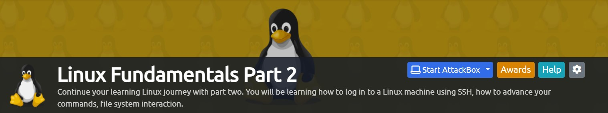

# Linux Fundamentals - Part 2

Hello blue teamers,

I hope that you have done and dusted the [first room](https://tryhackme.com/room/linuxfundamentalspart1),taking down notes and performing the hands-on labs. Here we are, with the [second installation](https://tryhackme.com/room/linuxfundamentalspart2) of the Linux Fundamentals series.

Room credits go to [tryhackme](https://tryhackme.com/p/tryhackme) and [CMNatic](https://twitter.com/CMNatic)

Let’s hop right in!

## Task 1 — Introduction

Welcome to the second part of the reworked “Linux Fundamentals” series. We’ll be applying our knowledge from the first installment in this series, so I highly recommend you to [complete that room](https://tryhackme.com/room/linuxfundamentalspart1) **before** proceeding further.

In part 2, we’ll be helping you get started in what is a fundamental skill in being able to login to and control the terminals of remote machines. Not only this, but the room will also have you:

* Unlocking the potential of your first few commands by introducing you to using flags and arguments
* Advancing your knowledge of the filesystem to perform some more useful commands such as copying and moving files
* Introducing you to the access mechanisms in place to keep files and folders secure and how to identify the things that our current user has access too
* Running your first few scripts and executables!

Let’s proceed!

## Task 2 — Accessing Your Linux Machine Using SSH (Deploy)

## Task 3 — Introduction to Flags and Switches

A majority of commands allow for arguments to be provided. These arguments are identified by a hyphen and a certain keyword known as flags or switches.

When using a command, unless otherwise specified, it will perform its default behavior. For example, `ls` lists the contents of the working directory. However, hidden files are not shown. We can use flags and switches to extend the behavior of commands.

Using our `ls` example, `ls` informs us that there are three files named "Example1.txt",” Example2.txt”, and “Example3.txt” as highlighted in the screenshot below.

&#x20;                                                     

However, after using the `-a` argument (short for `--all`), we now suddenly have an output with a few more files and folders such as ".face". Files and folders with "**.**" are hidden files.

&#x20;                                                    

Commands that accept these will also have the `--help` option. This option will list the possible options that the command accepts, provide a brief description and example of how to use it.

&#x20;                                                      

This option is, in fact, a formatted output of what is called the man page (short for manual), which contains documentation for Linux commands and applications.

### **The Man(ual) Page**

The manual pages are a great source of information for both system commands and applications available on both a Linux machine, which is accessible on the machine itself and [online](https://linux.die.net/man/).

To access this documentation, we can use the `man`command and then provide the command we want to read the documentation for. Using our ls example, we would use `man ls` to view the manual pages for `ls` like so:

&#x20;                                                       

**Answer the questions below**

> Q)Explore the manual page of the ls command

> A)No answer needed

> Q)What directional arrow key would we use to navigate down the manual page?

> A)down

> Q)What flag would we use to display the output in a “human-readable” way?

> A)-h

## Task 4 — Filesystem Interaction Continued

In this task, we’re going to learn some more commands for interacting with the filesystem to allow us to:

* create files and folders
* move files and folders
* delete files and folders

More specifically, the following commands:

| Command | Description                  |
| ------- | ---------------------------- |
| touch   | Create file                  |
| mkdir   | Create a folder              |
| cp      | Copy a file or folder        |
| mv      | Move a file or folder        |
| rm      | Remove a file or folder      |
| file    | Determine the type of a file |

### **Creating Files and Folders (touch, mkdir)**

Creating files and folders on Linux is a simple process. First, we’ll cover creating a file. The touch command takes exactly one argument — the name we want to give the file we create. For example, we can create the blank file “note.txt” by using the following command:

> Command — touch note.txt

&#x20;                                                          

This is a similar process for making a folder, which just involves using the `mkdir` command and providing the name that we want to assign to the directory. For example, creating the directory "mydirectory" using the following command:

> Command — mkdir mydirectory

&#x20;                                                          

### **Removing Files and Folders (rm)**

`rm` is extraordinary out of the commands that we've covered so far. You can simply remove files by using `rm`. &#x20;

&#x20;                                                           

You can remove a directory using the `rmdir` command

> Command — rmdir \<directory\_name>

> **NOTE:A directory should be empty (no files within),when deleting it.**

&#x20;                                                         

### **Cool little trick!**

If you have multiple files like text1, text2, text3, and so on, you can use the \* (wildcard) symbol to delete multiple files

> Command — rm text\*

&#x20;                                                           

### **Copying and Moving Files and Folders (cp, mv)**

Copying and moving files is an important functionality on a Linux machine. Starting with `cp`, this command takes two arguments:

1\. the name of the existing file

2\. the name we wish to assign to the new file when copying

`cp` copies the entire contents of the existing file into the new file. In the screenshot below, we are copying the contents of "file" to "file2".

&#x20;                                                             

Moving a file `mv`takes two arguments, the file you want to move and the target directory you want to move it to

> Command — mv \<file> \<target directory>

&#x20;                                                                

### **Determining File Type**

So far, the files we have used in our examples haven’t had an extension. Without knowing the context of why the file is there — we don’t know its purpose. Enter the `file` command. This command takes one argument and allows us to essentially know the type of file&#x20;

> Command — file \<name\_of\_file>

&#x20;                                                                 

**Answer the questions below**

> Q)How would you create the file named “newnote”?

> A)touch newnote

> Q)On the deployable machine, what is the file type of “unknown1” in “tryhackme’s” home directory?

> A)ASCII text

> Q)How would we move the file “myfile” to the directory “myfolder”?

> A)mv myfile myfolder

> Q)What are the contents of this file?

> A)THM{FILESYSTEM}

> Q)Continue to apply your knowledge and practice the commands from this task.

> A)No answer needed

&#x20;                                                                

## Task 5 — Permissions 101

As you would have already found out by now, certain users cannot access certain files or folders. We’ve previously explored some commands that can be used to determine what access we have and where it leads us. However, we're only interested in the first three columns:

&#x20;                                                       

| Permissions                      | Name of owner | Name of group owner | Name of file    |
| -------------------------------- | ------------- | ------------------- | --------------- |
| 
6 - 4 - 4

rw-r--r--
 | kali          | kali                | google.deb      |
| 
6 - 4 - 4

rw-r--r--
 | kali          | kali                | sample3.docx    |
| 
6 - 4 - 4

rw-r--r--
 | kali          | kali                | samplepptx.pptx |
| 
6 - 4 - 4

rw-r--r--
 | kali          | kali                | Text.txt        |

Although intimidating, these three columns are very important in determining certain characteristics of a file or folder and whether or not we have access to it. A file or folder can have a couple of characteristics that determine both what actions are allowed and what user or group can perform the given action — such as the following:

* Read (permission score = 4)
* Write (permission score = 2)
* Execute (permission score = 1)

### **Changing permissions on Linux (user-level)**

This is done by the `chmod`command

> Command — chmod +**(r/w/x)**+\[(r/w/x)+(r/w/x)] \<file\_name>

> where:-

> **(r/w/x) = necessary argument for chmod command.Apply one of the permissions or a mixture of two or more — Applies to user-level**

> \+\[(r/w/x)] = Optional,if you want to extend permissions for group-level and other-level

Suppose I want to add read-only permissions (at user level)

> Command — chmod 400 sample3.docx

> where:-

> 4 = read only permission for user-level — only ‘kali’ user will be able to read the file,from now on

> 0 = no permission for group-level

> 0 = read only permission for other-level

&#x20;                                                                 

Suppose I want to add read and write only permissions (in user level)

> Command — chmod 600 sample3.docx

> where:-

> 6 = read and write only permission for user-level — only ‘kali’ user will be able to read and write on the file,from now on

> 0 = no permission for group-level

> 0 = read only permission for other-level

&#x20;                                                              

You can apply a full set of user-level permissions by providing 700 (read+write+execute) to chmod

### **Switching between users**

> Command — su \<username>

**You are required to know two things to facilitate this transition of user accounts**:

* The user we wish to switch to
* The user’s password

&#x20;                                                

&#x20;                                    Switching between the ‘kali’ and ‘root’ user accounts

### **The differences Between Users & Groups**

We briefly explored this in Linux fundamentals part 1 (namely, the differences between a regular user and a system user). The great thing about Linux is that permissions can be so granular, that whilst a user technically owns a file, if the permissions have been set, then a group of users can also have either the same or a different set of permissions to the same file without affecting the file owner itself.

Let’s put this into a real-world context; the system user that runs a web server must have permission to read and write files for an effective web application. However, companies such as web hosting companies will have to want to allow their customers to upload their files for their website without being the webserver system user — compromising the security of every other customer.

**Answer the questions below**

> Q)On the deployable machine, who is the owner of “important”?

> A)user2

> Q)What would the command be to switch to the user “user2”?

> A)su user2

> Q)Now switch to this user “user2” using the password “user2”

> A)No answer needed

> Q)Output the contents of “important”, what is the flag?

> A)THM{SU\_USER2}

&#x20;                                                    

## Task 6 — Common Directories

### **/etc**

This root directory is one of the most important root directories on your system. The etc folder (short for etcetera) is a commonplace location to store system files that are used by your operating system.

For example, the sudoers file highlighted in the screenshot below contains a list of the users & groups that have permission to run sudo or a set of commands as the root user.

Also highlighted below are the “**passwd**” and “**shadow**” files. These two files are special for Linux as they show how your system stores the passwords for each user in encrypted formatting called sha512.

&#x20;                                                        

### **/var**

The “/var” directory, with “var” being short for variable data, is one of the main root folders found on a Linux install. This folder stores data that is frequently accessed or written by services or applications running on the system. For example, log files from running services and applications are written here (**/var/log**), or other data that is not necessarily associated with a specific user (i.e., databases and the like).

&#x20;                                                  

### **/root**

Unlike the **/home** directory, the **/root** folder is the home for the “root” system user. There isn’t anything more to this folder other than just understanding that this is the home directory for the “root” user.

### **/tmp**

This is a unique root directory found on a Linux install. Short for “**temporary**”, the /tmp directory is volatile and is used to store data that is only needed to be accessed once or twice. Similar to the memory on your computer, once the computer is restarted, the contents of this folder are cleared out.

&#x20;                                                            

**Answer the questions below**

> Q)Read me!

> A)No answer needed

> Q)What is the directory path that would we expect logs to be stored in?

> A)/var/log

> Q)What root directory is similar to how RAM on a computer works?

> A)/tmp

> Q)Name the home directory of the root user

> A)/root

> Q)Now apply your learning and navigate through these directories on the deployed Linux machine.

> A)No answer needed

## Task 7 — Conclusions and Summaries

Nice work! This room was quite theory-heavy and covered quite a range of the fundamentals in getting you familiar with Linux. To quickly recap, this room taught you:

* How to connect to a Linux machine remotely using SSH
* Advancing your use of commands by providing flags, switches and where you can go to learn about these for each command (man pages)
* Some more commands that you’ll frequently be using to interact with the filesystem and its contents
* A brief introduction to file permissions & switching users
* A summary paragraph of the important root directories on a Ubuntu Linux install and how we may be able to use the data stored within these.

I encourage you to go through this room again once or twice to gain some familiarity with the concepts. After all, practice makes perfect!

When you feel a little bit more comfortable, progress onto [Linux Fundamentals Part 3](https://tryhackme.com/room/linuxfundamentalspart3)

## Conclusion

This room allowed me to brush up and revise my command over the Linux CLI and it is a great ground to practice, for those who are new to the Linux game

Thank you for reading this entry. Stay tuned, as I go hunting behind some pcap files out there….

## Your opinion matters

My audience has a voice. Feel free to reach out to me, on my socials (links are on top of this page) for any queries to be addressed. Dropping a sweet message would make my day

Let your opinion about this write-up be known, by selecting any one of the emojis below!
