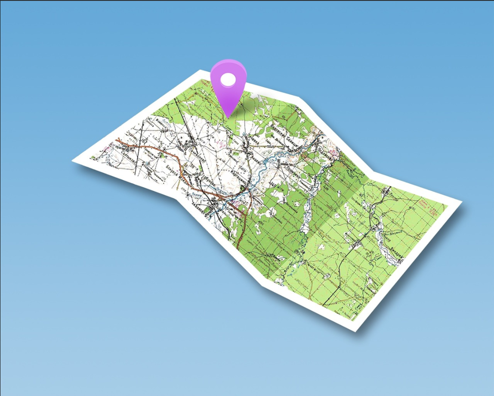

# Searchlight: A Walkthrough

.png>)

Hello, blue teamers,

Who is down to solve a few OSINT challenges?

[Try Hack Me](https://tryhackme.com) has an awesome OSINT themed room named [Searchlight: IMINT](https://tryhackme.com/room/searchlightosint), that I am attempting to solve in this blog entry. Hope it will be fun!

Room credits go to [zewen](https://twitter.com/Zewensec)

## Task  1 - Welcome to the Searchlight IMINT room!

In this room, we will be exploring the discipline of IMINT/GEOINT, which is short for Image intelligence and geospatial intelligence. This room is suited for those of you who are just beginning your OSINT journey or those brand new to the field of IMINT/GEOINT.

**This room will introduce you to several topics within IMINT, among them:**

1. Getting into the right mindset and how to be analytical
2. Visually extracting key data points from an image or video
3. Applying different tools to assist you in geolocation and answering context questions

**The flag format is** sl{flag} — this means that every answer needs to be submitted within the brackets, sl{your answer}.&#x20;

The answer to the question below is: ready

**Answer the questions below**

> Q) Did you understand the flag format?

> A) sl{ready}

## Task 2 — Your first challenge!



### **Let’s introduce you to your first tool — your eyes!**&#x20;

Before we can apply a tool or a methodology for finding the location of an image, we should use our eyes to scan the image for important information. Extracting key data points from the image will allow you to apply the right tool, craft a good Google search or identify which part of the world the image might have been taken in.

There are 5 elements of IMINT that you should consider when looking at an image, according to Geoint expert [Benjamin Strick](https://twitter.com/BenDoBrown):

\- Context\
\- Foreground\
\- Background\
\- Map markings\
\- Trial and error

A geolocation challenge like this lacks one important factor, which is the context or the source of the image. In real-world cases, you usually have a context in which the image was produced or shared, usually called context clues.&#x20;

**Here are some questions you should ask yourself while looking at the upcoming challenges:**

* Are there any obvious data in the image that reveals the location, like a street name or storefront signs?
* Can you determine the country or region of the image by, for instance, which side of the road they drive on, language, or architectural characteristics that may reveal a country or continent/region?
* Do you recognize road sign styles, nature, and environmental characteristics, or popular motor vehicle brands or vehicle types?
* What is the quality of any visible infrastructure? Is the road paved or do you see gravel roads?
* Do you see any unique landmarks, buildings, bridges, statues, or mountains that can help you geolocate the image?

Download the attached image and answer the question below — good luck!

We proceed to do just that and find it below:

&#x20;                                                   

**Answer the questions below**

> Q) What is the name of the street where this image was taken?

We can see the text ‘Carnaby Street’ on the signboard.

Subsequently, we identify that the street is located in Oxford, London, and is named Carnaby Street

We have got our answer!

> A) Carnaby Street

## Task 3  —  Just Google it!


&#x20;                                                      

The last challenge wasn’t a challenge, was it?

Let me introduce you to your first tool, Google! If you see anything in the image that can be extracted into a keyword, phrase, company name, telephone number, or any other question you may have as a result of scanning the image up and down: GOOGLE IT!

[Here](https://osintcurio.us/2019/12/20/google-dorks/) is a short introduction to what we call ‘dorking’, the art of using Google search queries to have Google return specific types of data. The next challenges will require you to do some basic Googling to answer the questions. You can also practice dorking by joining the Google Dorking [room](https://tryhackme.com/room/googledorking).

When geolocating a picture finding the exact location is key, but we may need to answer other questions about the location or the image as well, usually referred to as context questions.

Let’s proceed to download the task file.

&#x20;                                                          

**Answer the questions below**

> Q) Which city is the tube station located in?

Upon my first glance at the image, I was not able to decipher any information about the image.

A few phrases that I can see around are “Public Subway” “Underground” and something around the lines of “Circus Street”

Googling “Circus Street” did not give us any meaningful results initially, but I decided to have a look at the Google Images section for this search query. Look what I obtained below

&#x20;                  

&#x20;                                             Seems like we got both sides of the same picture

From the description, I found that the subway was located in Piccadilly, London, and connects Circus Street. Our guess wasn't wrong there!

> A) london

> Q)Which tube station do these stairs lead to?

> A) piccadilly circus

> Q)Which year did this station open?

This answer is just a Google search away!

> A) 1906

> Q)How many platforms are there in this station?

> A) 4

## Task 4  —  Keep at it!

&#x20;                                                   

Good job solving the last challenge!&#x20;

You were able to find the location of the image and by doing that, you could answer contextual questions about the location. This challenge will also require you to do some ‘Google dorking’ to answer the questions below.

Scan the image for data and remember the questions from the introduction — Do you see anything in the image that can be used in a search query or help you narrow down the potential location?

Let’s download the task file for this challenge


**Answer the questions below**

> Q) Which building is this photo taken in?

From the photo, we can make out the words ‘YVR.CA’.My mind went first to California and that the image was related to something in California.

Instead, I decided to google the phrase “YVR Connects” and came across this

&#x20;                                         

Vancouver International Airport is also abbreviated or known as “YVR”.Well, that's news to me!

Moreover, the airport is located in Canada. Well, that explains the “CA” acronym

> A) vancouver international airport

> Q) Which city is this building located in?

> A) richmond

## Task 5  —  Coffee and a light lunch

&#x20;                                           

Now that you’ve started to learn some techniques I figured we could try and do some good while we hone our skills.

> A friend of mine contacted me asking if I could help them locate a coffee shop that is supposed to serve the _best_ lunch there is. They told me the coffee shop is somewhere in Scotland, and he sent me these two pictures. Do you think you could locate it and answer the questions below for me?

Let’s download the task file, for this challenge

&#x20;                                              

**Answer the questions below**

> Q) Which city is this coffee shop located in?

From the downloaded file, we can distinctly make out the words “Edinburgh Woolen Mill”

Giving it a cursory search on Google reveals that the original branch is in Edinburgh, London

Well, we are searching for something in Scotland and we find just that, located in Glasgow, Scotland

&#x20;                                                

I had a tough time squaring the correct store down because there were 2 of them located in Scotland

We got it finally — using the help of images taken around the store’s surroundings and Google Streets

Address of the store —The Edinburgh Woollen Mill, 20 Wellmeadow, Blairgowrie PH10 6AS, United Kingdom

> A) Blairgowrie

> Q)Which street is this coffee shop located in?

The picture seems to be taken from the ‘Wee Coffee Shop’.Now to check which street it is located in

We get the answer, using Google Maps

&#x20;                       

> A) Allan Street

> Q)What is their phone number?

> A)sl{+447878 839128}

> Q)What is their email address?

This can easily be gained from the business's [Facebook page ](https://www.facebook.com/weecoffeeshop/)

> A)[sl{theweecoffeeshop@aol.com](mailto:sl%7Btheweecoffeeshop@aol.com)}

> Q)What is the surname of the owners?

From a cursory Google search, we can find that the owners are Debbie and David Cochrane.

> A)sl{cochrane}

#### Task 6 — Reverse your thinking

&#x20;                                                     

One of the methods for geolocating an image is to do an image reverse search. This means that we are searching for the image itself online, and if the image has been indexed by search engines we may find the exact image or we can do a visual search or crop search to help us find similar images.

[Aric Toler](https://twitter.com/AricToler) from [Bellingcat](https://www.bellingcat.com) has written a fantastic guide on reversing images, please read it [here](https://www.bellingcat.com/resources/how-tos/2019/12/26/guide-to-using-reverse-image-search-for-investigations/). [OSINT Curious](https://osintcurio.us) also has a [write-up](https://osintcurio.us/2020/04/12/tips-and-tricks-on-reverse-image-searches/) on the topic that you should look through before attempting this challenge.

I recommend adding this extension to ease the workflow for when you find images online that you want to do an image reverse on:

> **Addon description:** “Perform a search by image. Choose between the image search engines Google, Bing, Yandex, TinEye and Baidu.”

> **Chrome:** [RevEye Reverse Image Search ](https://chrome.google.com/webstore/search/RevEye%20Reverse%20Image%20Search?hl=no)-

> **Firefox:** [RevEye Reverse Image Search](https://addons.mozilla.org/nb-NO/firefox/addon/reveye-ris/)

Remember that changing the crop and the keywords for searching an image may yield completely different results.

Let’s proceed to download the task file

&#x20;                                                       

**Answer the questions below**

> Q)Which restaurant was this picture taken at?

Next, let me introduce you to [Yandex](https://yandex.com/images/)

Yandex has been a very awesome tool, in previous investigations. So what it does is reverse search images, that can allow you to extract information from an image.

So what I did first, was to upload the file to Yandex

We’ve caught the bull by the horns here!

&#x20;                                                      

> A)Katz’s deli

> Q)What is the name of the Bon Appétit editor that worked 24 hours at this restaurant?

This [article](https://www.bonappetit.com/story/katzs-deli-24-hours) is pretty hilarious!

> A)Andrew Knowlton

## Task 7  —  Locate this sculpture

&#x20;                                                  

This challenge will require you to apply some of the techniques I have touched on so far: Scanning the image for visual clues, reverse image searching, and Google dorking. Tools should not be your primary focus — don’t underestimate how far you can get with dorking and scrolling search results.

Let’s proceed to download the task file, attached with this image

&#x20;                                                     

**Answer the questions below**

> Q)What is the name of this statue?

Hmm, this looks pretty distinctive. A bike surmounted on top of a deer?

As usual, I took the help of TinEye this time, to get some sort of a clue

&#x20;                                                   

Ok, so we have got an important pointer, that the sculpture is located in Oslo, Norway.

Now, its time for some Google dorking

```
insite:deer and bike sculpture
```

In this case, the Images section was a lifesaver and we were able to zero in, on the sculpture

> A) Rudolph the Chrome Nosed Reindeer

> Q) Who took this image?

From the reverse search, it was found that the contributor of the image was an individual named ‘Henrik Jonsson’, but that necessarily won't be the answer

Some more hard searching brings us to our answer

> A) kjersti stensrud

## Task 8  —  …and justice for all

&#x20;                                                 

This challenge is a step up in difficulty from the previous challenges and you shouldn’t expect to solve this quickly, especially if you are new to IMINT. While you can certainly apply the techniques and tools you’ve used to s far, this challenge may force you to revise your thinking and your approach while you’re working on solving this challenge.

Let’s proceed to download the task file, attached with this image

**Answer the questions below**

> Q) What is the name of the character that the statue depicts?

A simple reverse search brings us to the answer

> A) lady justice

> Q) Where is this statue located?

So, we have all seen the Lady Justice statue before, but how can we pinpoint its location?

Yandex comes to the rescue again. Reverse searching the image brings the following results:

&#x20;                                                 

I had a hunch. What if we could find the location of the image, by clicking the links?

Let's how that works out:-

Link — 1 — Dead

Link 2 — Redirects to a Youtube video ([https://www.youtube.com/watch?app=desktop\&v=yLD3iX590IY](https://www.youtube.com/watch?app=desktop\&v=yLD3iX590IY)).

Around the 0:22 mark, you can see the statue distinctly placed in front of a building. I took a screenshot of the image below

&#x20;                                                   

Now, let’s reverse search this image. We get results that the building is named “Albert V Bryan United States Courthouse”, which is located in Alexandria, Virginia

> A) Alexandria, Virginia

> Q) What is the name of the building opposite from this statue?

I hope Google 360 is enough for this task

I have to admit. I had a wild (virtual) goose chase combing through the Courthouse Square, to find the course. It was nice to see the sights!

Finally, we are here

&#x20;                                                         

Turning around, and moving a few steps forward, we are here!

&#x20;                                                         

> A) The Westin Alexandria Old Town

## Task 9  —  The view from my hotel room

&#x20;                                                     

Geolocating videos aren’t much different from geolocating images. A video is just a string of images, usually played at 24 frames(or images) per second. In other words, a video will hold a whole lot more images that can be analyzed, reversed, and scrutinized by you.

Here’s a good [writeup](https://nixintel.info/osint-tools/using-ffmpeg-to-grab-stills-and-audio-for-osint/) by [Nixintel](https://twitter.com/nixintel) on a tool called [FFmpeg](https://ffmpeg.org), which will help you extract the key images from the video that you may need to solve this challenge. Download the attached video and follow Nixintel’s guide!

You may have to apply other tools to solve this challenge as well!

Let’s proceed to download the task file, attached with this image

**Answer the questions below**

What is the name of the hotel that my friend is staying in?

> Q) What is the name of the hotel that my friend is staying in?

> A) novotel singapore clarke quay

## Conclusion

This was a fun OSINT room. Just the way I like it :)

Thank you for reading this blog and stay tuned as I try to close down more SOC alerts……

## Your opinion matters

My audience has a voice. Feel free to reach out to me, on my socials (links are on top of this page) for any queries to be addressed. Dropping a sweet message would make my day

Let your opinion about this write-up be known, by selecting any one of the emojis below!
