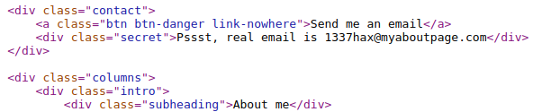

# WiCYS CyberStart (Amsterdam) Challenge 1

It's my first time signing up for CyberStart since being a WiCYS student member, and I am already very pumped to level up my cyber security skills

Let's make our way to [CyberStart](https://play.cyberstart.com/dashboard).After logging in, we find our base on the dashboard - titled 'Intern Base'

As part of our onboarding, we are provided an Internship letter, that tells us what we need to know. Pretty cool!

 (1).png>)

Let's proceed to select challenge 1, from the first quadrant

 (1) (1).png>)

## Briefing L01 C01

### Hello World

 (1).png>)

> We’ve found a profile page of a known hacker that we need to get in contact with but most of the information visible on the page is useless to us. However, there is one secret real way to contact him that he’s managed to inject on the page — a hidden email address. Intern, we need you to find his email address!

> **Tip**: The email address is the flag.

Having understood what is to be done, procced to the challenge.

The hacker's page is given to us, for viewing.

.png>)

## Flag Capture

Not having to dig through the front page, let's have a look through the page source. Scrolling a bit, we can find the email address of the hacker, as expected.

> Email — 1337hax@myaboutpage.com

Let's enter the flag and continue to the next challenge. Currently, we have 100 points on the scoreboard!

 (1).png>)
