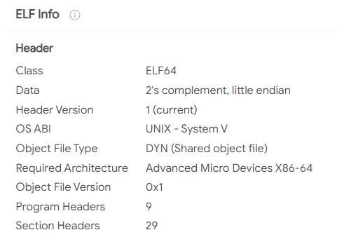

# WiCYS CyberStart (Amsterdam) Challenge 2

## Briefing L01 C02

### Mixed-up Messages

.png>)

> We’ve been informed that a group of hackers are communicating cryptically on a social media site.

> Their messages have been getting increasingly cryptic; so much so that all of the posts now look jumbled up and don’t seem to make any sense!

> We’ve found one post that we believe contains an important secret, and we need you to find out what that secret is so we can be ready to stop a possible cyber attack!

> **Tip**: The secret is the flag.

Let's go to the challenge

We are met with a social media page named Chirp (mimicking Twitter!) with HACKERBOT'S chirp (tweet)

At first glance, it looks like the text is written backward

## Flag Capture

Well, let's copy-paste the contents of the chirp and use on an [online utility](https://www.textreverse.com) to reverse the text&#x20;

Upon reversing the text, we find human-readable text, indicating the motive of the hackers

.png>)

So we have apparently got our flag - time4hackattack

Let's submit it and proceed to the next challenge. Currently, we have 200 points on the scoreboard

&#x20;Onward Ahoy!

