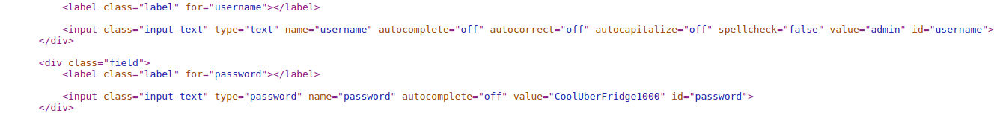

# WiCYS CyberStart (Amsterdam) Challenge 4

## Briefing L01 C04

### Lazy Locked Login

.png>)

> Our Dutch office recently bought a new Internet of Things (IoT) connected fridge. However, the temperature settings have been widely fluctuating as of late. All agents are currently out in the field and too busy to fix the problem.

> We know there is a remotely accessible technician’s page where fridge settings can be modified, and that the fridge’s login page isn’t very secure. It was easy enough to find the username and password, but the form still has some very lazy extra protection. Intern, can you see if the rumours are true, fix our fridge, and help us verify this reported security vulnerability?

> **Tip**: Successfully login to get the flag.

Proceed to the challenge

We are met with a remote fridge login page. Talk about sophisicated IOT Tech!

.png>)

Having a look at the source code of the webpage, we can see the username and password values

As a side note, we can see that the page submission will be restricted, if not accessed from the technician's laptop

Any hint for Burpsuite use here? Even if this attempt fails, we can still find a way out. Tampering a packet is totally my thing. Let's use capture the request using Burp Proxy and then use Repeater to tamper the packet and to view the response

Turning on Intercept and loading the page, we are met with this intercepted packet

.png>)

Alas, there are no parameters or fields for us to tamper. None of the available parameters can help us solve this quest!

There a door closes

We need some other method to edit the webpage. This can be achieved by Console Debugger

Right-click -> Inspect element

## Flag Capture

Keep expanding Highlight the keyword 'disabled' and delete it from the javascript

.png)

The submit button gets highlighted, indicating to submit the credentials.

We log in successfully and capture the flag!

.png>)

> Flag — 6jdhphYBuCXs24YhoLkR

### Scoreboard

.png>)

It's time to close down shop in the Amsterdam base and set it up somewhere else. Let's see where our CyberStart journey takes us.

Onward ahoy to the next challenge!

.jpg>)
