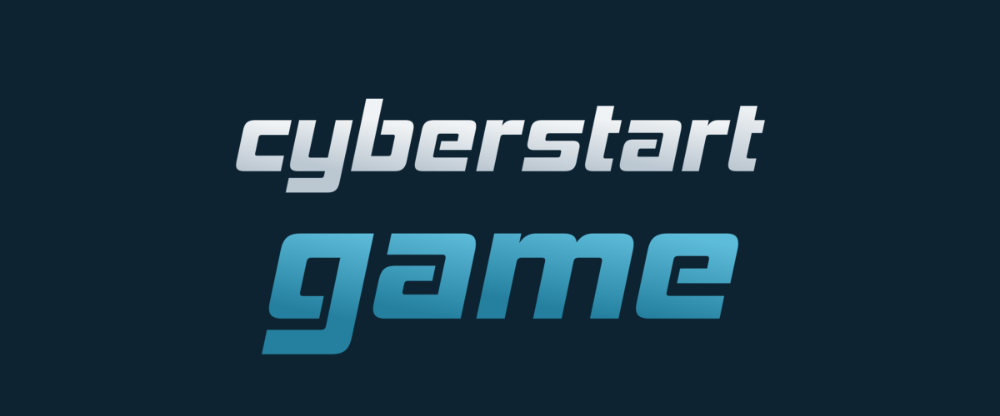

# WiCYS CyberStart (Tokyo) Challenge 2



## Briefing L02 C02

### **Spinlock**

&#x20;                                             

> A large bank has refitted all of their vaults with the new SpinLock Extreme. As fancy as it sounds we believe it has a rather critical vulnerability, one we think the Yakoottees have been exploiting in a series of recent bank robberies.

> The physical vault itself requires a special keycard to be inserted which, after checking the authenticity of the card, re-aligns the circular locking mechanism to unlock it and updates the interface to show it’s unlocked. However, we believe that the organisation has been remote accessing the interface on the vault, and unlocking the vault by doing it in reverse: getting the interface to unlock, which unlocks the physical vault itself. If we can confirm the method, we’ll be one step closer to understanding how this cyber gang operates!

> **Tip**: Unlock the vault to get the flag.

Proceeding to challenge 2, we are met with this awesome-looking spinlock

&#x20;                                                

What we can see is the circulating halo around the horizontal bar. Our objective is to make the red circle reach the middle of the halo.

I was pretty confused and stumped on how to proceed.

Having a look at the source code, we can see some Javascript code here

&#x20;                                               

Admittedly, I was not able to progress from this challenge on my own, so took help from this [online forum](https://www.thestudentroom.co.uk/showthread.php?t=5724206)

### The solution to crack the lock

What you need to do is to Right Click ->‘Inspect Element’ and then go to the Console

Type in these commands

```
turnCircle(“one”, -4)
turnCircle(“two”, -4)
turnCircle(“three”, -4)
```

### What are we doing here?

Trying to invoke the turnCircle function, we are trying to unlock the spinlock, aided with the degree measurement

&#x20;                                                     

### Flag Capture

Doing so will unlock the spinlock and we will get our flag

&#x20;                                                    

> Flag — GQAfbpYwacpgqPrI9KXa

We have 800 points racked up on the leaderboard!

&#x20;                                                    

Onward ahoy to the next challenge!
